# 🛠️ Guía del Programador - Interconecta Trucking

## 📋 Tabla de Contenidos

1. [Introducción](#introducción)
2. [Arquitectura del Sistema](#arquitectura-del-sistema)
3. [Stack Tecnológico](#stack-tecnológico)
4. [Estructura del Proyecto](#estructura-del-proyecto)
5. [Base de Datos](#base-de-datos)
6. [Autenticación y Seguridad](#autenticación-y-seguridad)
7. [Módulos Principales](#módulos-principales)
8. [APIs y Servicios Externos](#apis-y-servicios-externos)
9. [Edge Functions](#edge-functions)
10. [Testing](#testing)
11. [Deployment](#deployment)
12. [Convenciones de Código](#convenciones-de-código)
13. [Troubleshooting](#troubleshooting)

---

## Introducción

**Interconecta Trucking** es una plataforma SaaS fullstack para la gestión integral de operaciones de transporte de carga en México, con enfoque en cumplimiento normativo (SAT, SCT) y seguridad ISO 27001.

### Objetivos del Sistema
- ✅ Automatización de Carta Porte CFDI 4.0
- ✅ Gestión de flotas (conductores, vehículos, remolques)
- ✅ Mantenimiento predictivo
- ✅ Dashboard analítico con KPIs en tiempo real
- ✅ Cumplimiento normativo GDPR + ISO 27001

---

## Arquitectura del Sistema

```mermaid
graph TB
    subgraph "Frontend - React + Vite"
        UI[Componentes UI]
        HOOKS[Custom Hooks]
        STORES[Zustand Stores]
    end
    
    subgraph "Supabase Backend"
        AUTH[Auth Service]
        DB[(PostgreSQL)]
        STORAGE[Storage S3]
        EDGE[Edge Functions]
    end
    
    subgraph "Servicios Externos"
        PAC[PAC Timbrado]
        MAPS[Mapbox/Google Maps]
        SAT[Catálogos SAT]
    end
    
    UI --> HOOKS
    HOOKS --> STORES
    HOOKS --> AUTH
    HOOKS --> DB
    HOOKS --> STORAGE
    HOOKS --> EDGE
    
    EDGE --> PAC
    EDGE --> SAT
    UI --> MAPS
```



### Flujo de Datos

1. **Usuario interactúa** con componentes React
2. **Hooks personalizados** manejan lógica de negocio
3. **TanStack Query** gestiona cache y sincronización
4. **Supabase Client** comunica con backend
5. **RLS Policies** validan permisos en DB
6. **Edge Functions** procesan lógica compleja (timbrado, validaciones)

---

## Stack Tecnológico

### Frontend
| Tecnología | Versión | Propósito |
|-----------|---------|-----------|
| React | 18.3.1 | Framework UI |
| TypeScript | 5.x | Type safety |
| Vite | 5.x | Build tool |
| Tailwind CSS | 3.x | Styling |
| Shadcn/UI | Latest | Componentes base |
| TanStack Query | 5.x | Server state |
| Zustand | 5.x | Client state |
| React Router | 6.x | Routing |

### Backend (Supabase)
| Servicio | Propósito |
|----------|-----------|
| PostgreSQL 15 | Base de datos |
| Supabase Auth | JWT Authentication |
| Supabase Storage | Almacenamiento S3 |
| Edge Functions | Serverless (Deno) |
| RLS Policies | Row-level security |

### Librerías Clave
```json
{
  "jspdf": "PDF generation",
  "jspdf-autotable": "PDF tables",
  "mapbox-gl": "Maps visualization",
  "recharts": "Charts & analytics",
  "zod": "Schema validation",
  "axios": "HTTP client",
  "date-fns": "Date utilities"
}
```

---

## Estructura del Proyecto

```
interconecta-trucking/
├── src/
│   ├── components/          # Componentes React
│   │   ├── auth/            # Autenticación
│   │   ├── conductores/     # Gestión de conductores
│   │   ├── vehiculos/       # Gestión de vehículos
│   │   ├── remolques/       # Gestión de remolques
│   │   ├── cartaPorte/      # Carta Porte CFDI
│   │   ├── forms/           # Formularios compartidos
│   │   ├── security/        # Componentes de seguridad
│   │   └── ui/              # Componentes Shadcn
│   ├── hooks/               # Custom React Hooks
│   │   ├── auth/            # Hooks de autenticación
│   │   ├── ai/              # Validación con IA
│   │   └── use*.ts          # Hooks de entidades
│   ├── pages/               # Páginas principales
│   ├── services/            # Servicios de negocio
│   │   └── cartaPorte/      # Lógica Carta Porte
│   ├── integrations/        # Integraciones externas
│   │   └── supabase/        # Cliente Supabase
│   ├── lib/                 # Utilidades
│   └── types/               # TypeScript types
├── supabase/
│   ├── functions/           # Edge Functions (Deno)
│   └── migrations/          # Migraciones SQL
├── public/                  # Assets estáticos
└── docs/                    # Documentación adicional
```

### Componentes Principales

```typescript
// Estructura típica de un componente
src/components/vehiculos/
├── VehiculosList.tsx          // Lista paginada
├── VehiculoFormDialog.tsx     // Modal de creación/edición
├── VehiculoDetailsCard.tsx    // Vista de detalles
└── forms/
    ├── VehiculoFormRefactored.tsx    // Formulario principal
    ├── VehiculoBasicFields.tsx       // Campos básicos
    ├── VehiculoSegurosFields.tsx     // Campos de seguros
    └── VehiculoDocumentosSection.tsx // Subida de documentos
```

---

## Base de Datos

### Esquema ERD (Entidades Principales)


### Tablas Core

#### `usuarios`
```sql
CREATE TABLE usuarios (
  id UUID PRIMARY KEY REFERENCES auth.users,
  email TEXT UNIQUE NOT NULL,
  nombre TEXT,
  rfc TEXT,
  rol TEXT CHECK (rol IN ('admin', 'operador', 'conductor', 'cliente')),
  empresa TEXT,
  telefono TEXT,
  created_at TIMESTAMPTZ DEFAULT NOW()
);
```

#### `conductores`
```sql
CREATE TABLE conductores (
  id UUID PRIMARY KEY DEFAULT gen_random_uuid(),
  user_id UUID REFERENCES usuarios(id),
  nombre TEXT NOT NULL,
  apellido_paterno TEXT,
  apellido_materno TEXT,
  rfc TEXT,
  curp TEXT,
  num_licencia TEXT,
  tipo_licencia TEXT,
  vigencia_licencia DATE,
  foto_url TEXT,
  activo BOOLEAN DEFAULT TRUE,
  created_at TIMESTAMPTZ DEFAULT NOW()
);

-- RLS Policy
CREATE POLICY "Usuarios ven sus propios conductores"
  ON conductores FOR SELECT
  USING (auth.uid() = user_id OR is_superuser_secure(auth.uid()));
```

#### `vehiculos`
```sql
CREATE TABLE vehiculos (
  id UUID PRIMARY KEY DEFAULT gen_random_uuid(),
  user_id UUID REFERENCES usuarios(id),
  placa TEXT NOT NULL UNIQUE,
  marca TEXT,
  modelo TEXT,
  anio INTEGER,
  numero_serie_vin TEXT,
  config_vehicular TEXT,
  perm_sct TEXT,
  num_permiso_sct TEXT,
  capacidad_carga DECIMAL,
  tipo_carroceria TEXT,
  estado TEXT CHECK (estado IN ('disponible', 'en_viaje', 'mantenimiento', 'revision', 'fuera_servicio')),
  activo BOOLEAN DEFAULT TRUE
);
```

#### `carta_porte`
```sql
CREATE TABLE carta_porte (
  id UUID PRIMARY KEY DEFAULT gen_random_uuid(),
  user_id UUID REFERENCES usuarios(id),
  folio TEXT UNIQUE,
  version_carta_porte TEXT DEFAULT '3.0',
  transporte_internacional BOOLEAN DEFAULT FALSE,
  ubicacion_polo_origen UUID REFERENCES ubicaciones(id),
  ubicacion_polo_destino UUID REFERENCES ubicaciones(id),
  total_distancia_recorrida DECIMAL,
  status TEXT CHECK (status IN ('borrador', 'activa', 'completada', 'cancelada')),
  xml_generado TEXT,
  uuid_fiscal TEXT,
  pdf_url TEXT,
  created_at TIMESTAMPTZ DEFAULT NOW()
);
```

#### `documentos_entidades`
```sql
CREATE TABLE documentos_entidades (
  id UUID PRIMARY KEY DEFAULT gen_random_uuid(),
  user_id UUID REFERENCES usuarios(id),
  entidad_tipo TEXT CHECK (entidad_tipo IN ('conductor', 'vehiculo', 'remolque', 'socio')),
  entidad_id UUID NOT NULL,
  tipo_documento TEXT NOT NULL,
  nombre_archivo TEXT NOT NULL,
  ruta_archivo TEXT NOT NULL,
  fecha_vencimiento DATE,
  activo BOOLEAN DEFAULT TRUE,
  created_at TIMESTAMPTZ DEFAULT NOW()
);

-- Índices
CREATE INDEX idx_documentos_entidad ON documentos_entidades(entidad_tipo, entidad_id, activo);
CREATE INDEX idx_documentos_vencimiento ON documentos_entidades(fecha_vencimiento) WHERE activo = TRUE;
```

### Funciones PostgreSQL Críticas

#### `is_superuser_secure()`
```sql
CREATE OR REPLACE FUNCTION is_superuser_secure(user_id UUID)
RETURNS BOOLEAN
LANGUAGE plpgsql
SECURITY DEFINER
SET search_path = public
AS $$
BEGIN
  RETURN EXISTS (
    SELECT 1 FROM usuarios
    WHERE id = user_id AND rol = 'admin'
  );
END;
$$;
```

#### `check_rate_limit()`
```sql
CREATE OR REPLACE FUNCTION check_rate_limit(
  p_identifier TEXT,
  p_action_type TEXT,
  p_max_attempts INTEGER DEFAULT 5,
  p_window_minutes INTEGER DEFAULT 15
)
RETURNS BOOLEAN
LANGUAGE plpgsql
AS $$
DECLARE
  attempt_count INTEGER;
BEGIN
  SELECT COUNT(*) INTO attempt_count
  FROM rate_limit_log
  WHERE identifier = p_identifier
    AND action_type = p_action_type
    AND created_at >= NOW() - INTERVAL '1 minute' * p_window_minutes;
    
  RETURN attempt_count < p_max_attempts;
END;
$$;
```

---

## Autenticación y Seguridad

### Sistema de Autenticación

```typescript
// Hook de autenticación segura
import { useSecureAuth } from '@/hooks/auth/useSecureAuth';

const { secureLogin, secureRegister, secureLogout, isLoading } = useSecureAuth();

// Login con rate limiting y auditoría
const handleLogin = async () => {
  const success = await secureLogin(email, password);
  if (success) {
    navigate('/dashboard');
  }
};

// Registro con validación de RFC
const handleRegister = async () => {
  const success = await secureRegister(
    email, 
    password, 
    nombre, 
    rfc, 
    empresa, 
    telefono
  );
};
```

### RLS Policies - Principios

1. **Default Deny**: Todas las tablas tienen RLS habilitado sin políticas permisivas
2. **User Isolation**: Cada usuario solo ve sus propios registros
3. **Admin Override**: Admins pueden ver todos los registros con `is_superuser_secure()`
4. **Audit Trail**: Todos los cambios sensibles se registran en `security_audit_log`

```sql
-- Ejemplo de política completa
CREATE POLICY "usuarios_select_own_records"
  ON conductores FOR SELECT
  USING (auth.uid() = user_id OR is_superuser_secure(auth.uid()));

CREATE POLICY "usuarios_insert_own_records"
  ON conductores FOR INSERT
  WITH CHECK (auth.uid() = user_id);

CREATE POLICY "usuarios_update_own_records"
  ON conductores FOR UPDATE
  USING (auth.uid() = user_id)
  WITH CHECK (auth.uid() = user_id);
```

### Sistema de Rate Limiting

```typescript
// En cualquier operación sensible
const { checkRateLimit, recordRateLimitAttempt } = useAuthValidation();

const handleSensitiveAction = async () => {
  // Verificar límite
  const canProceed = await checkRateLimit(userEmail, 'login_attempt');
  if (!canProceed) {
    toast.error('Demasiados intentos. Espera 15 minutos.');
    return;
  }

  // Registrar intento
  await recordRateLimitAttempt(userEmail, 'login_attempt');
  
  // Proceder con la acción...
};
```

### Auditoría de Seguridad

```typescript
// Registro automático de eventos
const { logSecurityEvent } = useAuthValidation();

await logSecurityEvent(
  userId,
  'password_reset_requested',
  { email: userEmail, timestamp: new Date().toISOString() },
  ipAddress,
  userAgent
);

// Eventos auditables:
- login_success / login_failed
- password_reset_requested / password_updated
- document_view_requested
- admin_access_performed
- sensitive_data_exported
```

---

## Módulos Principales

### 1. Gestión de Flota

#### Conductores
```typescript
// Hook principal
const { 
  conductores, 
  loading, 
  createConductor, 
  updateConductor, 
  deleteConductor 
} = useConductores();

// Estructura de datos
interface Conductor {
  id: string;
  nombre: string;
  apellido_paterno: string;
  rfc: string;
  curp: string;
  num_licencia: string;
  tipo_licencia: 'A' | 'B' | 'C' | 'D' | 'E';
  vigencia_licencia: string;
  foto_url?: string;
  vehiculo_asignado_id?: string;
  activo: boolean;
}
```

#### Vehículos
```typescript
const { vehiculos, crearVehiculo, actualizarVehiculo } = useVehiculos();

interface Vehiculo {
  placa: string;
  config_vehicular: string; // Clave SAT
  perm_sct: string;
  capacidad_carga: number;
  tipo_carroceria: string;
  estado: 'disponible' | 'en_viaje' | 'mantenimiento';
  // Campos de costos para optimización
  costo_mantenimiento_km: number;
  costo_llantas_km: number;
  valor_vehiculo: number;
  factor_peajes: number;
}
```

### 2. Carta Porte CFDI 4.0

#### Flujo de Generación


#### Componentes Carta Porte

```typescript
// Editor principal
import { CartaPorteEditor } from '@/components/cartaPorte/CartaPorteEditor';

// Secciones
<CartaPorteUbicaciones />  // Origen/Destino
<CartaPorteMercancias />   // Mercancías y embalajes
<CartaPorteAutotransporte /> // Vehículo, conductor, remolques
<CartaPorteFiguras />      // Operador, propietario

// Validación en tiempo real con IA
const { validateCompleteWithAI } = useAIValidationEnhanced();
const result = await validateCompleteWithAI(formData);
```

#### Catálogos SAT

```typescript
// Gestión de catálogos
const { 
  catalogos, 
  loadCatalogo, 
  searchInCatalogo 
} = useCatalogosSAT();

// Catálogos disponibles:
- c_ClaveUnidad (unidades de medida)
- c_TipoPermiso (permisos SCT)
- c_ConfigAutotransporte (configuraciones vehiculares)
- c_TipoEmbalaje (tipos de embalaje)
- c_MaterialPeligroso (claves materiales peligrosos)
```

### 3. Sistema de Documentos

#### Subida y Gestión

```typescript
const { 
  cargarDocumentos, 
  subirDocumento, 
  eliminarDocumento 
} = useDocumentosEntidades();

// Subir documento con vencimiento automático
await subirDocumento(
  file,
  'conductor',         // Tipo de entidad
  conductorId,
  'licencia_conducir', // Tipo de documento
  fechaVencimiento     // Opcional, calculado según tipo
);

// Tipos de documento por entidad:
CONDUCTOR: licencia_conducir, comprobante_domicilio, curp, certificado_medico
VEHICULO: tarjeta_circulacion, poliza_seguro, permiso_sct, verificacion
REMOLQUE: tarjeta_circulacion, certificado_capacidad
SOCIO: constancia_fiscal, identificacion_oficial, poder_notarial
```

#### Alertas de Vencimiento

```sql
-- Query para documentos próximos a vencer
SELECT * FROM documentos_entidades
WHERE activo = TRUE
  AND fecha_vencimiento IS NOT NULL
  AND fecha_vencimiento BETWEEN NOW() AND NOW() + INTERVAL '30 days'
ORDER BY fecha_vencimiento ASC;
```

### 4. Dashboard Analítico

```typescript
// KPIs principales
const { kpis, loading } = useFlotaKPIs();

interface KPIs {
  vehiculosActivos: number;
  vehiculosEnViaje: number;
  conductoresDisponibles: number;
  viajesCompletados: number;
  ingresosEsteMes: number;
  gastosEsteMes: number;
  rentabilidadPromedio: number;
  utilizacionFlota: number; // %
}

// Gráficos con Recharts
<ResponsiveContainer width="100%" height={300}>
  <LineChart data={historicoViajes}>
    <XAxis dataKey="fecha" />
    <YAxis />
    <Tooltip />
    <Line type="monotone" dataKey="viajes" stroke="hsl(var(--primary))" />
  </LineChart>
</ResponsiveContainer>
```

---

## APIs y Servicios Externos

### 1. PAC (Timbrado CFDI)
```typescript
// Conectia SW (https://sw.com.mx)
const TIMBRADO_API = 'https://services.sw.com.mx/cfdi-service';

// Headers requeridos
headers: {
  'Content-Type': 'application/json',
  'user': process.env.SW_USER,
  'password': process.env.SW_PASSWORD
}

// Endpoint de timbrado
POST /api/v1/cfdi40/issue/json
Body: { comprobante: xmlBase64 }
```

### 2. Mapbox GL
```typescript
import mapboxgl from 'mapbox-gl';

mapboxgl.accessToken = 'pk.eyJ1Ij...';

const map = new mapboxgl.Map({
  container: mapRef.current,
  style: 'mapbox://styles/mapbox/streets-v12',
  center: [-99.1332, 19.4326], // CDMX
  zoom: 12
});

// Rutas optimizadas
const response = await fetch(
  `https://api.mapbox.com/directions/v5/mapbox/driving/${coordinates}?geometries=geojson&access_token=${token}`
);
```

### 3. Catálogos SAT
```typescript
// Edge Function que sincroniza catálogos
// supabase/functions/sync-catalogos-sat/index.ts

const SAT_CATALOGOS_URL = 'http://omawww.sat.gob.mx/tramitesyservicios/Paginas/catalogos_cartaporte.htm';

// Se ejecuta semanalmente con pg_cron
SELECT cron.schedule(
  'sync-catalogos-sat',
  '0 2 * * 0', -- Cada domingo a las 2 AM
  $$SELECT net.http_post(
    url:='https://[proyecto].supabase.co/functions/v1/sync-catalogos-sat',
    headers:='{"Authorization": "Bearer [anon-key]"}'
  )$$
);
```

---

## Edge Functions

### Listado de Funciones

| Función | Propósito | Invocación |
|---------|-----------|------------|
| `generar-xml-cartaporte` | Genera XML v3.0/3.1 | `POST /generar-xml-cartaporte` |
| `timbrar-cfdi` | Envía a PAC para timbrado | `POST /timbrar-cfdi` |
| `validar-rfc-sat` | Valida RFC contra lista SAT | `POST /validar-rfc-sat` |
| `decrypt-document` | Desencripta documentos sensibles | `POST /decrypt-document` |
| `export-gdpr-data` | Exporta datos del usuario | `POST /export-gdpr-data` |

### Ejemplo: Generar XML Carta Porte

```typescript
// supabase/functions/generar-xml-cartaporte/index.ts

import { serve } from 'https://deno.land/std@0.168.0/http/server.ts';
import { createClient } from 'https://esm.sh/@supabase/supabase-js@2';

serve(async (req) => {
  const { cartaPorteId } = await req.json();
  
  // Autenticar usuario
  const supabase = createClient(
    Deno.env.get('SUPABASE_URL')!,
    Deno.env.get('SUPABASE_ANON_KEY')!,
    { global: { headers: { Authorization: req.headers.get('Authorization')! } } }
  );
  
  const { data: { user } } = await supabase.auth.getUser();
  if (!user) return new Response('Unauthorized', { status: 401 });
  
  // Cargar datos completos de la Carta Porte
  const { data: cartaPorte } = await supabase
    .from('carta_porte')
    .select(`
      *,
      ubicacion_origen:ubicaciones!ubicacion_polo_origen(*),
      ubicacion_destino:ubicaciones!ubicacion_polo_destino(*),
      mercancias(*),
      autotransporte(
        vehiculo:vehiculos(*),
        conductor:conductores(*),
        remolques(*)
      )
    `)
    .eq('id', cartaPorteId)
    .single();
  
  // Construir XML según versión 3.0 o 3.1
  const xml = buildCartaPorteXML(cartaPorte);
  
  // Guardar XML en storage
  const { data: uploadData } = await supabase.storage
    .from('documentos')
    .upload(`carta-porte/${cartaPorteId}.xml`, xml, {
      contentType: 'application/xml'
    });
  
  return new Response(JSON.stringify({ 
    success: true, 
    xmlPath: uploadData.path 
  }));
});
```

### Testing Edge Functions Localmente

```bash
# Instalar Supabase CLI
npm install -g supabase

# Iniciar funciones localmente
supabase functions serve generar-xml-cartaporte --env-file .env.local

# Probar con curl
curl -X POST http://localhost:54321/functions/v1/generar-xml-cartaporte \
  -H "Authorization: Bearer ${ANON_KEY}" \
  -H "Content-Type: application/json" \
  -d '{"cartaPorteId": "uuid-aqui"}'
```

---

## Testing

### Estructura de Tests

```
src/
├── __tests__/
│   ├── components/
│   │   └── ConductorForm.test.tsx
│   ├── hooks/
│   │   └── useConductores.test.ts
│   ├── services/
│   │   └── CartaPorteService.test.ts
│   └── utils/
│       └── validators.test.ts
```

### Configuración Vitest

```typescript
// vitest.config.ts
import { defineConfig } from 'vitest/config';
import react from '@vitejs/plugin-react';

export default defineConfig({
  plugins: [react()],
  test: {
    environment: 'jsdom',
    setupFiles: ['./src/__tests__/setup.ts'],
    coverage: {
      provider: 'v8',
      reporter: ['text', 'json', 'html'],
      exclude: ['node_modules/', 'src/__tests__/']
    }
  }
});
```

### Ejemplo de Test

```typescript
// src/__tests__/components/ConductorForm.test.tsx
import { render, screen, waitFor } from '@testing-library/react';
import userEvent from '@testing-library/user-event';
import { ConductorFormRefactored } from '@/components/conductores/forms/ConductorFormRefactored';

describe('ConductorFormRefactored', () => {
  it('debe validar campos requeridos', async () => {
    const onSuccess = vi.fn();
    render(<ConductorFormRefactored onSuccess={onSuccess} />);
    
    const submitButton = screen.getByText('Crear Conductor');
    await userEvent.click(submitButton);
    
    await waitFor(() => {
      expect(screen.getByText('El nombre es requerido')).toBeInTheDocument();
    });
  });
  
  it('debe llamar onSuccess al guardar exitosamente', async () => {
    const onSuccess = vi.fn();
    render(<ConductorFormRefactored onSuccess={onSuccess} />);
    
    await userEvent.type(screen.getByLabelText('Nombre'), 'Juan Pérez');
    await userEvent.click(screen.getByText('Crear Conductor'));
    
    await waitFor(() => {
      expect(onSuccess).toHaveBeenCalled();
    });
  });
});
```

### Correr Tests

```bash
# Todos los tests
npm run test

# Con coverage
npm run test:coverage

# Watch mode
npm run test:watch

# Tests específicos
npm run test -- ConductorForm
```

---

## Deployment

### Variables de Entorno Requeridas

```bash
# .env.production
VITE_SUPABASE_URL=https://qulhweffinppyjpfkknh.supabase.co
VITE_SUPABASE_ANON_KEY=eyJhbGciOiJIUzI1NiIsInR5cCI6IkpXVCJ9...
VITE_MAPBOX_TOKEN=pk.eyJ1IjoiaW50ZXJjb25lY3RhLXRydWNraW5nIiwiYSI6ImNtNGx6...

# Edge Functions Secrets (configurados en Supabase Dashboard)
SW_USER=usuario_pac
SW_PASSWORD=password_pac
SW_API_URL=https://services.sw.com.mx
```

### Build de Producción

```bash
# Instalar dependencias
npm install

# Build optimizado
npm run build

# Preview del build
npm run preview
```

### CI/CD con GitHub Actions

```yaml
# .github/workflows/deploy.yml
name: Deploy to Production

on:
  push:
    branches: [main]

jobs:
  deploy:
    runs-on: ubuntu-latest
    steps:
      - uses: actions/checkout@v3
      
      - name: Setup Node
        uses: actions/setup-node@v3
        with:
          node-version: '18'
          
      - name: Install dependencies
        run: npm ci
        
      - name: Run tests
        run: npm run test:coverage
        
      - name: Build
        run: npm run build
        env:
          VITE_SUPABASE_URL: ${{ secrets.VITE_SUPABASE_URL }}
          VITE_SUPABASE_ANON_KEY: ${{ secrets.VITE_SUPABASE_ANON_KEY }}
          
      - name: Deploy to Lovable
        run: |
          # Deployment automático (Lovable lo maneja)
```

---

## Convenciones de Código

### Nomenclatura

```typescript
// Componentes: PascalCase
ConductorFormRefactored.tsx
VehiculoDocumentosSection.tsx

// Hooks: camelCase con prefijo 'use'
useConductores.ts
useSecureAuth.ts

// Utilities: camelCase
formatCurrency.ts
validateRFC.ts

// Constantes: UPPER_SNAKE_CASE
const MAX_FILE_SIZE = 10 * 1024 * 1024;
const TIPOS_DOCUMENTO_CONDUCTOR = [...];
```

### Estructura de Componentes

```typescript
// 1. Imports
import React, { useState } from 'react';
import { Button } from '@/components/ui/button';

// 2. Interfaces/Types
interface ComponentProps {
  id?: string;
  onSuccess?: () => void;
}

// 3. Component
export function Component({ id, onSuccess }: ComponentProps) {
  // 3.1 Hooks
  const [loading, setLoading] = useState(false);
  const { data } = useCustomHook();
  
  // 3.2 Effects
  useEffect(() => {
    // ...
  }, []);
  
  // 3.3 Handlers
  const handleClick = () => {
    // ...
  };
  
  // 3.4 Render
  return (
    <div>
      <Button onClick={handleClick} />
    </div>
  );
}
```

### Manejo de Estado

```typescript
// ❌ NO: Estado en múltiples lugares
const [nombre, setNombre] = useState('');
const [rfc, setRFC] = useState('');
// ... 20 estados más

// ✅ SÍ: Estado consolidado
const [formData, setFormData] = useState({
  nombre: '',
  rfc: '',
  // ...
});

const handleFieldChange = (field: string, value: any) => {
  setFormData(prev => ({ ...prev, [field]: value }));
};
```

### Validación con Zod

```typescript
import { z } from 'zod';

const conductorSchema = z.object({
  nombre: z.string()
    .min(1, 'El nombre es requerido')
    .max(100, 'Máximo 100 caracteres'),
  rfc: z.string()
    .regex(/^[A-Z]{3,4}\d{6}[A-Z0-9]{3}$/, 'RFC inválido'),
  email: z.string()
    .email('Email inválido')
    .optional()
});

type ConductorFormData = z.infer<typeof conductorSchema>;
```

---

## Troubleshooting

### Errores Comunes

#### 1. RLS Policy Denies Access

**Error:**
```
new row violates row-level security policy for table "conductores"
```

**Solución:**
```sql
-- Verificar que el usuario esté autenticado
SELECT auth.uid(); -- Debe retornar UUID, no NULL

-- Verificar política existe
SELECT * FROM pg_policies WHERE tablename = 'conductores';

-- Agregar política faltante
CREATE POLICY "usuarios_insert_own"
  ON conductores FOR INSERT
  WITH CHECK (auth.uid() = user_id);
```

#### 2. Edge Function Timeout

**Error:**
```
Edge Function timed out after 60s
```

**Solución:**
```typescript
// Implementar procesamiento por lotes
const BATCH_SIZE = 100;
const batches = chunk(items, BATCH_SIZE);

for (const batch of batches) {
  await Promise.all(batch.map(item => processItem(item)));
}
```

#### 3. Storage Upload Fails

**Error:**
```
Storage upload failed: Bucket 'documentos' does not exist or is not public
```

**Solución:**
```sql
-- Crear bucket si no existe
INSERT INTO storage.buckets (id, name, public)
VALUES ('documentos', 'documentos', false);

-- Agregar política de upload
CREATE POLICY "usuarios_upload_own_docs"
  ON storage.objects FOR INSERT
  WITH CHECK (
    bucket_id = 'documentos' AND
    auth.uid()::text = (storage.foldername(name))[1]
  );
```

#### 4. TypeScript Errors en Supabase Types

**Error:**
```
Property 'conductores' does not exist on type 'Database'
```

**Solución:**
```bash
# Regenerar types desde schema
supabase gen types typescript --project-id qulhweffinppyjpfkknh > src/integrations/supabase/types.ts
```

### Debugging Tips

```typescript
// 1. Log de queries Supabase
import { supabase } from '@/integrations/supabase/client';

const { data, error } = await supabase
  .from('conductores')
  .select('*')
  .eq('user_id', userId);

console.log('Query result:', { data, error });

// 2. Inspeccionar RLS context
const { data } = await supabase.rpc('debug_auth_context');
console.log('Auth context:', data); // { user_id, role, ... }

// 3. Validar permisos en tiempo real
const { data: canAccess } = await supabase.rpc('can_user_access_conductor', {
  p_conductor_id: conductorId
});
```

---

## Recursos Adicionales

### Documentación Oficial
- [Supabase Docs](https://supabase.com/docs)
- [React Query Docs](https://tanstack.com/query/latest)
- [SAT Carta Porte](http://omawww.sat.gob.mx/cartaporte/)

### Herramientas de Desarrollo
- [Supabase Studio](https://supabase.com/dashboard) - DB GUI
- [Postman Collection](./postman/interconecta-api.json) - API testing
- [Figma Design System](https://figma.com/...) - UI/UX

### Contacto Técnico
- 📧 Email: dev@interconecta.capital
- 💬 Slack: #interconecta-dev
- 📖 Wiki: https://wiki.interconecta.capital

---

**Última actualización:** 2025-01-11  
**Versión del documento:** 1.0.0
