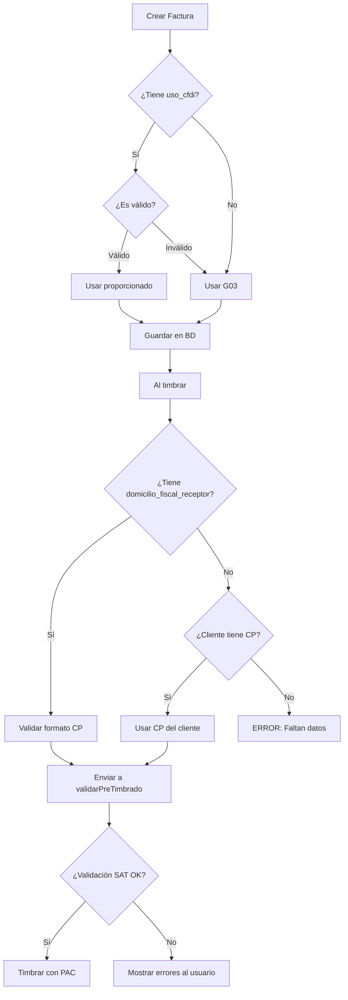

# Corrección de Errores de Validación Fiscal para Timbrado

## 📋 Resumen del Problema

Al intentar timbrar una factura, se presentaban dos errores críticos de validación fiscal según el SAT:

1. **domicilio_fiscal_receptor = NULL**: Campo obligatorio en CFDI 4.0
2. **uso_cfdi = "P01"**: Código inválido en el catálogo SAT c_UsoCFDI

## ❌ Errores Encontrados

### Error 1: Domicilio Fiscal Receptor Faltante

```json
{
  "campo": "domicilio_fiscal_receptor",
  "valorActual": "NULL",
  "valorEsperado": "Código postal de 5 dígitos",
  "fuente": "CFDI 4.0 - Campo obligatorio",
  "severidad": "critico"
}
```

**Causa**: La factura no incluía el código postal del domicilio fiscal del receptor al momento del timbrado.

### Error 2: Uso de CFDI Inválido

```json
{
  "campo": "uso_cfdi",
  "valorActual": "P01",
  "valorEsperado": "Código del catálogo c_UsoCFDI",
  "fuente": "Catálogo SAT c_UsoCFDI",
  "severidad": "error"
}
```

**Causa**: El código "P01" no existe en el catálogo oficial del SAT. Los códigos válidos son:
- **G01-G03**: Gastos
- **I01-I08**: Inversión
- **D01-D10**: Deducción
- **S01**: Sueldos
- **CP01**: Complemento de pago
- **CN01**: Nota de crédito

## ✅ Soluciones Implementadas

### 1. Validación de uso_cfdi en `ViajeOrchestrationService.ts`

**Ubicación**: `src/services/viajes/ViajeOrchestrationService.ts` línea 358-365

**Antes**:
```typescript
uso_cfdi: facturaData.usoCfdi || 'G03',
```

**Después**:
```typescript
uso_cfdi: ['G01', 'G02', 'G03', 'I01', 'I02', 'I03', 'I04', 'I05', 'I06', 'I07', 'I08', 'D01', 'D02', 'D03', 'D04', 'D05', 'D06', 'D07', 'D08', 'D09', 'D10', 'S01', 'CP01', 'CN01'].includes(facturaData.usoCfdi) 
  ? facturaData.usoCfdi 
  : 'G03', // Gastos en general (valor por defecto seguro)
```

**Beneficios**:
- ✅ Valida contra el catálogo oficial SAT
- ✅ Previene el uso de códigos inválidos
- ✅ Usa un fallback seguro ('G03' - Gastos en general)

### 2. Agregar domicilio_fiscal_receptor en Creación de Factura

**Ubicación**: `src/services/viajes/ViajeOrchestrationService.ts` línea 366

**Nuevo campo agregado**:
```typescript
domicilio_fiscal_receptor: wizardData.cliente?.domicilio_fiscal?.codigo_postal || null,
```

**Fuente de datos**: 
- Se obtiene del campo `domicilio_fiscal.codigo_postal` del cliente
- Si no existe, se guarda como `null` (será validado antes del timbrado)

### 3. Validación en Payload de Timbrado

**Ubicación**: `src/components/modals/ViajeTrackingModal.tsx` línea 252-259

**Antes**:
```typescript
usoCfdi: facturaData.uso_cfdi,
```

**Después**:
```typescript
usoCfdi: ['G01', 'G02', 'G03', ... , 'CN01'].includes(facturaData.uso_cfdi || '')
  ? facturaData.uso_cfdi
  : 'G03',
domicilioFiscalReceptor: facturaData.domicilio_fiscal_receptor || viajeCompleto?.cliente?.domicilio_fiscal?.codigo_postal || null,
```

**Beneficios**:
- ✅ Doble validación antes de enviar al PAC
- ✅ Intenta recuperar el código postal del cliente si no está en la factura
- ✅ Cumple con requisitos de CFDI 4.0

## 📊 Flujo de Validación Fiscal



## 🔍 Validaciones del SAT Implementadas

La función `validarPreTimbrado` en `supabase/functions/_shared/validadorFiscal.ts` valida:

### Emisor
- ✅ RFC debe coincidir con configuración_empresa
- ✅ Nombre debe coincidir EXACTAMENTE con SAT
- ✅ Régimen fiscal debe ser válido

### Receptor
- ✅ RFC formato válido (12-13 caracteres alfanuméricos)
- ✅ **Domicilio fiscal con código postal de 5 dígitos** (CRÍTICO)
- ✅ Régimen fiscal válido

### Campos Transaccionales
- ✅ **Uso CFDI válido según catálogo SAT**
- ✅ Forma de pago (01-99)
- ✅ Método de pago (PUE/PPD)
- ✅ Moneda (MXN, USD, EUR, etc.)

### Importes
- ✅ Subtotal > 0 (para tipo "I" Ingreso)
- ✅ Total coherente con subtotal + impuestos

## 🛠️ Cómo Prevenir Estos Errores en el Futuro

### 1. Al Crear Clientes

**SIEMPRE** capturar:
- ✅ RFC
- ✅ Nombre/Razón Social
- ✅ Régimen Fiscal
- ✅ **Código Postal del Domicilio Fiscal** (5 dígitos)
- ✅ Uso de CFDI preferido (validado contra catálogo)

### 2. Al Crear Facturas

Validar ANTES de guardar:
```typescript
// Validar uso_cfdi
const USOS_CFDI_VALIDOS = ['G01', 'G02', 'G03', ... , 'CN01'];
if (!USOS_CFDI_VALIDOS.includes(usoCfdi)) {
  throw new Error('Uso de CFDI inválido');
}

// Validar domicilio fiscal
if (!codigoPostal || !/^\d{5}$/.test(codigoPostal)) {
  throw new Error('Código postal del receptor inválido');
}
```

### 3. Al Timbrar

La validación `validarPreTimbrado` se ejecuta **automáticamente** antes de enviar al PAC y verifica TODOS los campos contra las fuentes oficiales del SAT.

## 📚 Referencias

- **Catálogo c_UsoCFDI**: [Anexo 20 SAT - c_UsoCFDI](http://omawww.sat.gob.mx/tramitesyservicios/Paginas/catalogos_emision_cfdi_complemento_carta_porte.htm)
- **CFDI 4.0 Especificaciones**: Campo `DomicilioFiscalReceptor` es obligatorio desde CFDI 4.0
- **Validador Fiscal**: `supabase/functions/_shared/validadorFiscal.ts`

## ✅ Checklist de Verificación

Antes de timbrar una factura, verificar:

- [ ] Cliente tiene código postal de domicilio fiscal (5 dígitos)
- [ ] Uso de CFDI es uno de los válidos del catálogo SAT
- [ ] RFC emisor coincide con configuración_empresa
- [ ] Nombre emisor coincide EXACTAMENTE con el SAT
- [ ] Régimen fiscal del receptor es válido
- [ ] Subtotal y Total son coherentes

---

**Última actualización**: 2025-11-24  
**Versión**: 1.0  
**Autor**: Sistema de Validación Fiscal
