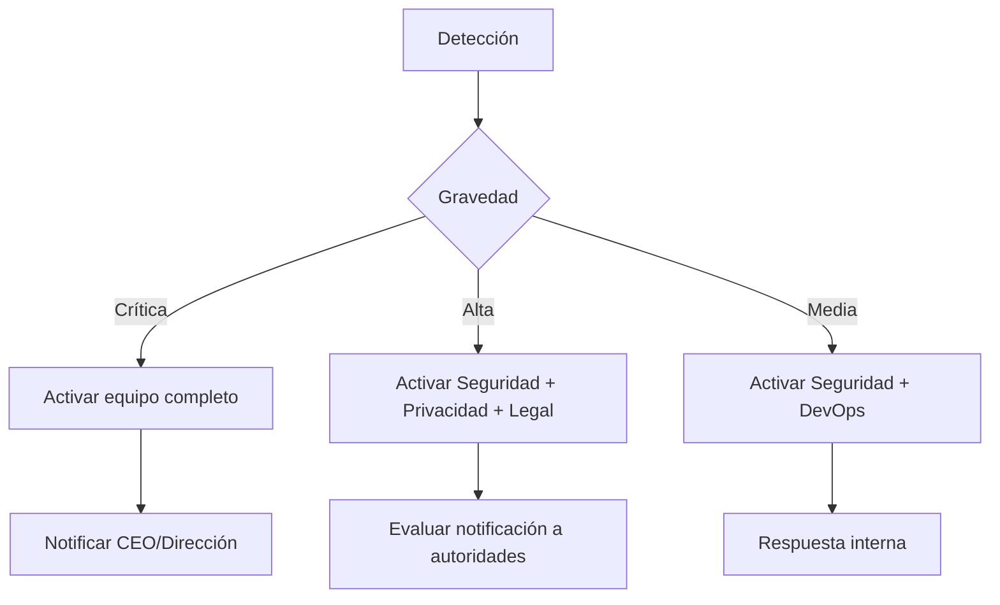

# 🚨 Plan de Respuesta a Violación de Datos

**Versión**: 1.0  
**Fecha de vigencia**: 2025-01-10  
**Responsable**: Equipo de Seguridad y Cumplimiento  
**Controles**: GDPR Art. 33-34, ISO 27001 A.16.1, LFPDPPP Art. 20

---

## 📋 Índice

1. [Definición de Violación de Datos](#definición-de-violación-de-datos)
2. [Equipo de Respuesta](#equipo-de-respuesta)
3. [Proceso de Respuesta (4 Fases)](#proceso-de-respuesta)
4. [Notificación a Autoridades](#notificación-a-autoridades)
5. [Notificación a Usuarios](#notificación-a-usuarios)
6. [Plantillas de Comunicación](#plantillas-de-comunicación)
7. [Post-Mortem y Mejora Continua](#post-mortem-y-mejora-continua)

---

## 🎯 Definición de Violación de Datos

**GDPR Art. 4(12)**: "Violación de la seguridad de los datos personales: toda violación de la seguridad que ocasione la destrucción, pérdida o alteración accidental o ilícita de datos personales transmitidos, conservados o tratados de otra forma, o la comunicación o acceso no autorizados a dichos datos."

### Tipos de Violación

| Tipo | Descripción | Ejemplos | Gravedad |
|------|-------------|----------|----------|
| **Confidencialidad** | Acceso no autorizado | Filtración de base de datos, hack | 🔴 Crítica |
| **Integridad** | Modificación no autorizada | Alteración de Cartas Porte, datos | 🟠 Alta |
| **Disponibilidad** | Pérdida de acceso | Ransomware, eliminación accidental | 🟡 Media-Alta |

### Umbrales de Notificación

| Escenario | ¿Notificar a autoridad? | ¿Notificar a usuarios? |
|-----------|-------------------------|------------------------|
| Acceso a >100 registros con PII sensible | ✅ Sí (72 horas) | ✅ Sí (sin demora) |
| Acceso a <100 registros sin datos sensibles | ⚠️ Evaluar riesgo | ⚠️ Evaluar riesgo |
| Intento de acceso bloqueado (sin éxito) | ❌ No (solo log interno) | ❌ No |
| Pérdida de backup cifrado | ⚠️ Evaluar (baja probabilidad de daño) | ❌ Probablemente no |

---

## 👥 Equipo de Respuesta a Incidentes

### Roles y Responsabilidades

| Rol | Responsable | Responsabilidades | Contacto |
|-----|-------------|-------------------|----------|
| **Líder de Incidentes** | [Nombre] | Coordinación general, toma de decisiones | +52 (55) XXXX-XXXX |
| **Oficial de Seguridad** | [Nombre] | Análisis técnico, contención | security@example.com |
| **Responsable de Privacidad/DPO** | [Nombre] | Evaluación de impacto, notificaciones | privacy@example.com |
| **Legal** | [Nombre] | Asesoría legal, comunicaciones oficiales | legal@example.com |
| **Comunicaciones** | [Nombre] | Comunicación interna/externa | comms@example.com |
| **DevOps** | [Nombre] | Remediación técnica, recuperación | devops@example.com |

### Escalamiento



---

## 🔄 Proceso de Respuesta (4 Fases)

### Fase 1: Detección y Contención (0-4 horas)

#### Objetivos
- ⏱️ Detectar la violación lo antes posible
- 🛑 Contener el incidente para prevenir daño adicional
- 📝 Preservar evidencia para investigación

#### Acciones

| # | Acción | Responsable | Plazo |
|---|--------|-------------|-------|
| 1.1 | Confirmar la violación (¿es real o falsa alarma?) | Seguridad | 15 min |
| 1.2 | Activar equipo de respuesta | Líder | 30 min |
| 1.3 | Aislar sistemas afectados | DevOps | 1 hora |
| 1.4 | Cambiar credenciales comprometidas | DevOps | 1 hora |
| 1.5 | Preservar logs y evidencia | Seguridad | 2 horas |
| 1.6 | Documentar timeline inicial | Líder | 2 horas |

#### Contención Técnica

```sql
-- Si se detecta acceso no autorizado a PII:

-- 1. Revocar todas las sesiones activas del usuario comprometido
DELETE FROM auth.sessions WHERE user_id IN (
  SELECT DISTINCT user_id FROM security_audit_log 
  WHERE event_type = 'suspicious_access' 
  AND created_at > now() - interval '1 hour'
);

-- 2. Registrar el incidente
INSERT INTO security_audit_log (user_id, event_type, event_data, severity)
VALUES (
  NULL,
  'data_breach_detected',
  jsonb_build_object(
    'detection_time', now(),
    'affected_tables', ARRAY['conductores', 'socios'],
    'estimated_records', 250,
    'containment_actions', 'Sessions revoked, credentials rotated'
  ),
  'critical'
);

-- 3. Bloquear IPs sospechosas (si se identifican)
-- (Esto se haría a nivel de firewall/Supabase Dashboard)
```

---

### Fase 2: Evaluación de Impacto (4-24 horas)

#### Objetivos
- 📊 Determinar el alcance de la violación
- 🎯 Identificar datos afectados
- ⚖️ Evaluar el riesgo para los usuarios

#### Acciones

| # | Acción | Responsable | Plazo |
|---|--------|-------------|-------|
| 2.1 | Identificar datos accedidos/modificados/eliminados | Seguridad | 4 horas |
| 2.2 | Contar usuarios afectados | DevOps | 4 horas |
| 2.3 | Evaluar sensibilidad de los datos | Privacidad | 8 horas |
| 2.4 | Determinar probabilidad y gravedad del daño | Privacidad | 8 horas |
| 2.5 | Decidir si se requiere notificación | Legal + Privacidad | 12 horas |

#### Análisis de Impacto

```sql
-- Consulta para identificar usuarios afectados
SELECT 
  u.id,
  u.email,
  p.nombre,
  p.rfc,
  CASE 
    WHEN EXISTS (SELECT 1 FROM conductores c WHERE c.user_id = u.id AND c.foto_licencia_url IS NOT NULL) 
      THEN 'DATOS_SENSIBLES'
    ELSE 'DATOS_BASICOS'
  END as tipo_datos,
  ARRAY_AGG(DISTINCT sal.event_type) as eventos_sospechosos
FROM auth.users u
JOIN profiles p ON p.id = u.id
LEFT JOIN security_audit_log sal ON sal.user_id = u.id 
  AND sal.created_at BETWEEN '[FECHA_INICIO_INCIDENTE]' AND '[FECHA_FIN_INCIDENTE]'
  AND sal.event_type IN ('unauthorized_access', 'suspicious_query', 'data_exfiltration')
WHERE sal.id IS NOT NULL
GROUP BY u.id, u.email, p.nombre, p.rfc;
```

#### Matriz de Evaluación de Riesgo

| Datos Afectados | Cantidad | Sensibilidad | Riesgo | Notificación Requerida |
|-----------------|----------|--------------|--------|------------------------|
| RFC, nombres | <100 | Baja | 🟢 Bajo | ❌ No (probablemente) |
| RFC, nombres, emails | 100-1000 | Media | 🟡 Medio | ⚠️ Evaluar |
| RFC, emails, teléfonos, direcciones | >1000 | Media-Alta | 🟠 Alto | ✅ Sí |
| Fotos de licencia, certificados | >10 | 🔴 Muy Alta | 🔴 Crítico | ✅ Sí (inmediato) |

---

### Fase 3: Notificación (24-72 horas)

#### Objetivos
- 📢 Notificar a la autoridad de protección de datos (INAI en México, AEPD en España)
- 📧 Notificar a los usuarios afectados
- 🤝 Colaborar con autoridades

#### 3.1. Notificación a Autoridades

**GDPR Art. 33**: Notificación en **72 horas** desde que se tuvo conocimiento  
**LFPDPPP**: Notificación "sin dilación indebida"

**Autoridades competentes**:
- **México**: INAI (Instituto Nacional de Transparencia, Acceso a la Información y Protección de Datos Personales)
- **España/UE**: AEPD (Agencia Española de Protección de Datos) o autoridad nacional correspondiente

**Información requerida** (GDPR Art. 33):
- [x] Naturaleza de la violación (tipo, causa)
- [x] Categorías y número aproximado de interesados afectados
- [x] Categorías y número aproximado de registros afectados
- [x] Nombre y contacto del DPO o punto de contacto
- [x] Descripción de las posibles consecuencias
- [x] Medidas adoptadas o propuestas para remediar

**Canales de notificación**:
- **INAI (México)**: https://home.inai.org.mx/
- **AEPD (España)**: https://sedeagpd.gob.es/

---

#### 3.2. Notificación a Usuarios Afectados

**GDPR Art. 34**: Notificación "sin dilación indebida" si hay **alto riesgo** para derechos y libertades

**¿Cuándo notificar?**
- ✅ Datos sensibles comprometidos (licencias, certificados)
- ✅ Datos que permiten suplantación de identidad (RFC + nombre + email)
- ✅ Más de 1000 usuarios afectados
- ⚠️ Evaluar: Datos básicos (solo nombre + email)
- ❌ NO notificar: Datos cifrados sin acceso a clave

**Medios de notificación**:
1. Email directo (preferido)
2. Notificación in-app (UI)
3. Comunicación pública (si >10,000 afectados o difícil contactar individualmente)

---

### Fase 4: Remediación y Recuperación (72 horas - 30 días)

#### Objetivos
- 🔧 Corregir la vulnerabilidad que causó la violación
- 🛡️ Implementar controles adicionales
- 📊 Monitorear para prevenir recurrencia

#### Acciones

| # | Acción | Responsable | Plazo |
|---|--------|-------------|-------|
| 4.1 | Identificar causa raíz | Seguridad + DevOps | 7 días |
| 4.2 | Aplicar parches de seguridad | DevOps | 7 días |
| 4.3 | Actualizar políticas RLS (si aplica) | DevOps | 7 días |
| 4.4 | Rotar secretos comprometidos | DevOps | Inmediato |
| 4.5 | Implementar monitoreo adicional | Seguridad | 14 días |
| 4.6 | Capacitar al equipo | Seguridad | 30 días |
| 4.7 | Actualizar plan de respuesta | Líder | 30 días |

---

## 📧 Plantillas de Comunicación

### Plantilla 1: Notificación a Autoridad (GDPR Art. 33)

```
Asunto: Notificación de Violación de Datos Personales - [Referencia]

A la Autoridad de Protección de Datos [INAI/AEPD]:

En cumplimiento del Artículo 33 del GDPR / Artículo 20 de la LFPDPPP, notificamos una violación de datos personales:

1. NATURALEZA DE LA VIOLACIÓN:
   - Tipo: [Confidencialidad / Integridad / Disponibilidad]
   - Causa: [Acceso no autorizado / Error humano / Fallo técnico]
   - Fecha de detección: [FECHA]
   - Fecha estimada de ocurrencia: [FECHA]

2. DATOS AFECTADOS:
   - Categorías de interesados: Usuarios transportistas, conductores
   - Número aproximado: [CANTIDAD] personas
   - Categorías de datos: RFC, nombre, email, [otros]
   - Número de registros: [CANTIDAD] registros

3. CONTACTO:
   - Responsable de Privacidad: [Nombre]
   - Email: privacy@example.com
   - Teléfono: +52 (55) XXXX-XXXX

4. CONSECUENCIAS PROBABLES:
   - Riesgo de suplantación de identidad: [Alto/Medio/Bajo]
   - Riesgo de fraude: [Alto/Medio/Bajo]
   - Otros riesgos: [Describir]

5. MEDIDAS ADOPTADAS:
   - Contención: [Describir acciones inmediatas]
   - Notificación a usuarios: [Sí/No/En proceso]
   - Remediación: [Describir medidas técnicas]

Quedamos a disposición para cualquier información adicional.

Atentamente,
[Nombre del Responsable de Privacidad]
[Empresa]
```

---

### Plantilla 2: Notificación a Usuarios (GDPR Art. 34)

**Email**:

```
Asunto: Información Importante sobre la Seguridad de tu Cuenta

Estimado/a [NOMBRE],

Te escribimos para informarte sobre un incidente de seguridad que puede haber afectado tus datos personales.

¿QUÉ OCURRIÓ?
El [FECHA], detectamos [describir incidente de manera clara y sencilla].

¿QUÉ DATOS SE VIERON AFECTADOS?
[Listar datos específicos: RFC, nombre, email, etc.]

¿QUÉ HEMOS HECHO?
- Contenimos el incidente inmediatamente
- Notificamos a las autoridades de protección de datos
- [Otras acciones tomadas]

¿QUÉ DEBES HACER?
- Cambia tu contraseña inmediatamente (si aplica)
- Revisa tu actividad reciente en la plataforma
- Estate atento/a a emails o llamadas sospechosas
- Contacta con nosotros si detectas actividad inusual

¿CÓMO TE PROTEGEMOS EN EL FUTURO?
[Describir medidas adicionales implementadas]

Para más información o preguntas, contacta con:
Email: privacy@example.com
Teléfono: +52 (55) XXXX-XXXX

Lamentamos sinceramente cualquier inconveniente.

Atentamente,
Equipo de Seguridad
[Empresa]
```

---

### Plantilla 3: Comunicación Interna (Equipo)

**Slack/Email Interno**:

```
🚨 INCIDENTE DE SEGURIDAD - CONFIDENCIAL 🚨

DETECCIÓN: [FECHA Y HORA]
GRAVEDAD: [Crítica/Alta/Media]
ESTADO: [Contención/Evaluación/Remediación]

RESUMEN:
[Descripción breve del incidente]

DATOS AFECTADOS:
- Tablas: [Listar]
- Usuarios: ~[CANTIDAD]
- Tipo de datos: [Listar]

ACCIONES INMEDIATAS:
- [x] Sistemas aislados
- [x] Credenciales rotadas
- [ ] Notificación a autoridades (en proceso)
- [ ] Notificación a usuarios (pendiente)

PRÓXIMOS PASOS:
1. [Acción] - Responsable: [Nombre] - Plazo: [Fecha]
2. [Acción] - Responsable: [Nombre] - Plazo: [Fecha]

EQUIPO ACTIVO:
- Líder: [Nombre]
- Seguridad: [Nombre]
- DevOps: [Nombre]
- Legal: [Nombre]

CANAL DE COMUNICACIÓN:
#incident-response-[ID]

CONFIDENCIAL - NO COMPARTIR FUERA DEL EQUIPO
```

---

## 📊 Post-Mortem y Mejora Continua

### Reunión Post-Mortem (Máximo 7 días después)

#### Agenda
1. **Timeline completo del incidente** (sin culpar a nadie)
2. **¿Qué funcionó bien?**
3. **¿Qué podríamos haber hecho mejor?**
4. **Causa raíz** (técnica y organizacional)
5. **Acciones correctivas**

#### Documento Post-Mortem

```markdown
# Post-Mortem: Incidente [ID] - [Fecha]

## Resumen Ejecutivo
- **Fecha**: [FECHA]
- **Duración**: [X] horas
- **Impacto**: [X] usuarios, [Y] registros
- **Causa raíz**: [Descripción]

## Timeline

| Hora | Evento |
|------|--------|
| 10:15 | Detección inicial (alerta de monitoreo) |
| 10:30 | Confirmación del incidente |
| 10:45 | Equipo activado |
| 11:00 | Contención completada |
| ... | ... |

## ¿Qué funcionó bien?
- ✅ Detección rápida (15 minutos)
- ✅ Activación eficiente del equipo
- ✅ Logs preservados correctamente

## Áreas de mejora
- ⚠️ Notificación a usuarios tardó más de lo esperado
- ⚠️ No teníamos plantilla de email preparada
- ⚠️ Faltó coordinación Legal-Seguridad

## Acciones correctivas

| # | Acción | Responsable | Plazo | Estado |
|---|--------|-------------|-------|--------|
| 1 | Crear plantillas pre-aprobadas | Legal | 7 días | ⏳ |
| 2 | Implementar alerta automática | DevOps | 14 días | ⏳ |
| 3 | Capacitar equipo en protocolo | Seguridad | 30 días | ⏳ |
```

---

## 📞 Contactos de Emergencia

### Internos

| Rol | Nombre | Teléfono 24/7 | Email |
|-----|--------|---------------|-------|
| Líder de Incidentes | [Nombre] | +52 XXX | leader@example.com |
| Oficial de Seguridad | [Nombre] | +52 XXX | security@example.com |
| Privacidad/DPO | [Nombre] | +52 XXX | privacy@example.com |
| Legal | [Nombre] | +52 XXX | legal@example.com |

### Externos

| Entidad | Contacto | Teléfono | Web |
|---------|----------|----------|-----|
| **INAI (México)** | [Contacto] | 800-835-4324 | https://home.inai.org.mx/ |
| **Supabase Support** | Enterprise Support | N/A | https://supabase.com/support |
| **Asesor Legal Externo** | [Firma] | [Teléfono] | [Email] |

---

**Última actualización**: 2025-01-10  
**Próxima revisión**: 2025-07-10 (semestral)  
**Aprobado por**: [Nombre del Líder de Incidentes]

---

## 📚 Referencias

- GDPR Art. 33: https://gdpr-info.eu/art-33-gdpr/
- GDPR Art. 34: https://gdpr-info.eu/art-34-gdpr/
- ISO 27001 A.16.1: Gestión de incidentes de seguridad
- LFPDPPP Art. 20: Notificación de violaciones de seguridad
