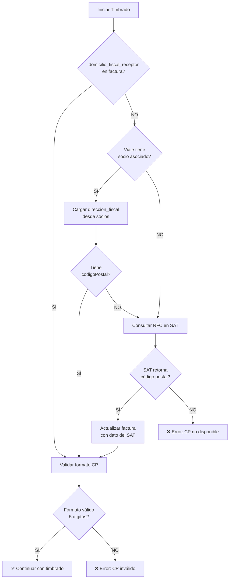

# Solución Error CFDI40147

## 🚨 Error

```
CFDI40147 - El campo DomicilioFiscalReceptor del receptor, debe encontrarse 
en la lista de RFC inscritos no cancelados en el SAT.
```

## 📋 Causa Raíz

**CFDI 4.0 requiere obligatoriamente el código postal del domicilio fiscal del receptor.**

Este campo:
- ✅ Es **OBLIGATORIO** en la versión 4.0 del CFDI (no lo era en versión 3.3)
- ✅ Debe ser el código postal **REGISTRADO EN EL SAT** para ese RFC
- ✅ El SAT valida en tiempo real que el CP corresponda al RFC del receptor
- ❌ Si falta o no coincide con el padrón del SAT, el CFDI es rechazado

## 🔍 Validación del Sistema

### Paso 1: Verificar datos del receptor en la factura

```sql
SELECT 
  id,
  folio,
  rfc_receptor,
  nombre_receptor,
  domicilio_fiscal_receptor,
  regimen_fiscal_receptor
FROM facturas
WHERE id = 'FACTURA_ID';
```

**Campo crítico:** `domicilio_fiscal_receptor` NO debe ser NULL.

### Paso 2: Verificar datos del socio/cliente

```sql
SELECT 
  id,
  nombre_razon_social,
  rfc,
  direccion_fiscal->>'codigoPostal' as codigo_postal,
  regimen_fiscal
FROM socios
WHERE id = 'SOCIO_ID';
```

El campo `direccion_fiscal` debe contener el código postal registrado en el SAT.

## ✅ Solución Implementada

### 1. Validación Pre-Timbrado (ValidadorFiscalCompleto.ts)

```typescript
// Validación crítica en frontend
if (!factura.domicilio_fiscal_receptor) {
  errores.push({
    campo: 'domicilio_fiscal_receptor',
    valorActual: 'NULL',
    valorEsperado: 'Código postal de 5 dígitos',
    fuente: 'CFDI 4.0 - Campo obligatorio',
    accion: 'Completa el código postal del receptor',
    severidad: 'critico'
  });
}
```

### 2. Consulta Automática al SAT (ViajeDetalle.tsx)

```typescript
// Si falta el código postal, consultar al SAT
const { data: consultaSAT } = await supabase.functions.invoke('consultar-rfc-sat', {
  body: { rfc: rfcReceptor }
});

if (consultaSAT?.encontrado && consultaSAT.codigoPostal) {
  // Actualizar factura con dato oficial del SAT
  await supabase
    .from('facturas')
    .update({ domicilio_fiscal_receptor: consultaSAT.codigoPostal })
    .eq('id', facturaId);
}
```

### 3. Validación en Edge Function (validadorFiscal.ts)

```typescript
// Validación final antes de enviar al PAC
const domicilioFiscalReceptor = facturaData.domicilioFiscalReceptor;
if (!domicilioFiscalReceptor || !/^\d{5}$/.test(String(domicilioFiscalReceptor))) {
  return error CFDI40147;
}
```

## 📊 Fuentes de Datos Correctas

### Orden de prioridad para obtener código postal del receptor:

1. **`facturas.domicilio_fiscal_receptor`** (si ya está guardado)
2. **`socios.direccion_fiscal.codigoPostal`** (si el viaje tiene socio asociado)
3. **API SAT vía SmartWeb** (consulta en tiempo real)

### Flujo de Resolución



## 🔧 Correcciones Manuales

### Para corregir facturas existentes sin código postal:

```sql
-- Opción 1: Actualizar desde socios asociados
UPDATE facturas f
SET domicilio_fiscal_receptor = (
  SELECT s.direccion_fiscal->>'codigoPostal'
  FROM viajes v
  INNER JOIN socios s ON v.socio_id = s.id
  WHERE v.id = f.viaje_id
    AND s.direccion_fiscal->>'codigoPostal' IS NOT NULL
)
WHERE f.domicilio_fiscal_receptor IS NULL
  AND f.viaje_id IS NOT NULL;

-- Opción 2: Actualizar manualmente con código postal conocido
UPDATE facturas
SET domicilio_fiscal_receptor = '01000' -- CP del receptor
WHERE rfc_receptor = 'CACX7605101P8'
  AND domicilio_fiscal_receptor IS NULL;
```

## ⚠️ Prevención

### Al crear nuevos clientes/socios:

1. **SIEMPRE solicitar código postal del domicilio fiscal**
2. Validar que sea de 5 dígitos
3. Idealmente, validar contra el catálogo `codigos_postales_mexico`
4. Guardar en `socios.direccion_fiscal.codigoPostal`

### Al crear facturas:

1. **SIEMPRE incluir `domicilio_fiscal_receptor`**
2. Obtener desde `socios.direccion_fiscal.codigoPostal`
3. Si no está disponible, consultar al SAT antes de crear la factura
4. NO permitir facturación sin este dato

## 📚 Referencias

- [Anexo 20 SAT - Guía CFDI 4.0](http://omawww.sat.gob.mx/tramitesyservicios/Paginas/anexo_20.htm)
- [Validador RFC SAT](https://www.sat.gob.mx/aplicacion/login/43824/verifica-tu-informacion-fiscal)
- [SmartWeb API - Consulta RFC](https://developers.sw.com.mx/knowledge-base/consultar-rfc/)

## 🎯 Resultado Esperado

✅ Todas las facturas deben tener `domicilio_fiscal_receptor` antes de timbrar  
✅ El código postal debe ser el registrado oficialmente en el SAT  
✅ Validación automática en 3 capas: frontend → edge function → PAC  
✅ Error claro y específico si falta o es inválido  
✅ NO autocorrecciones - Solo consultas a fuentes oficiales (SAT)
