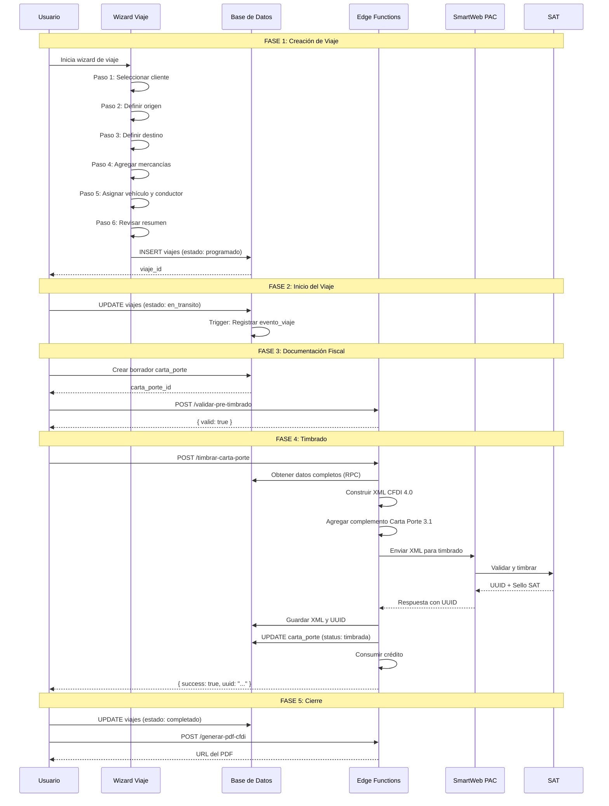
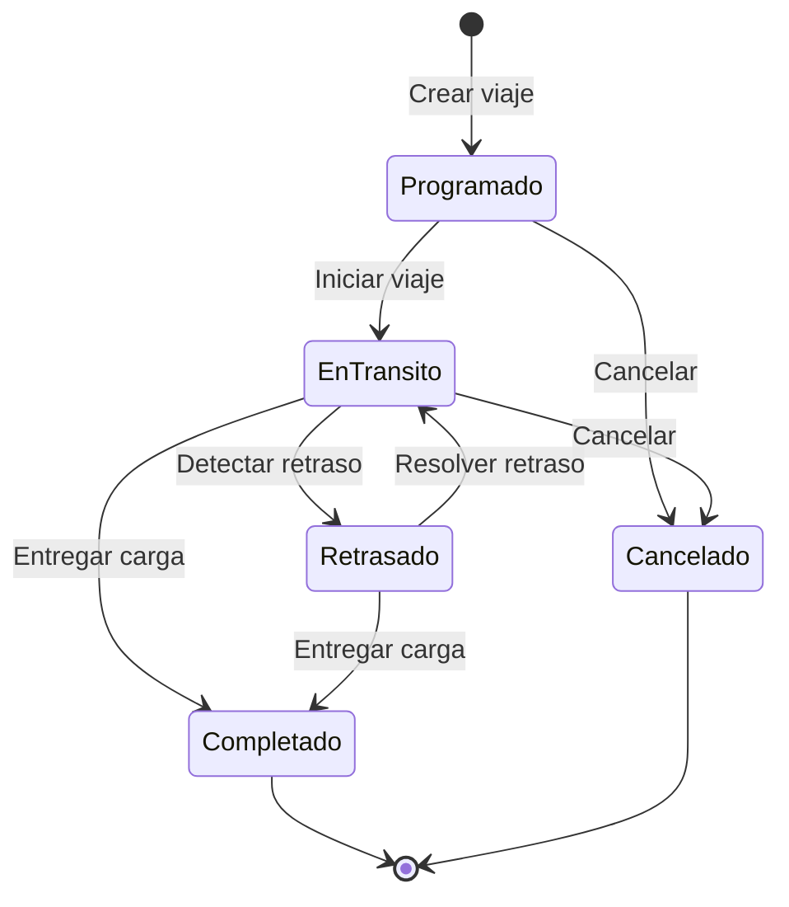
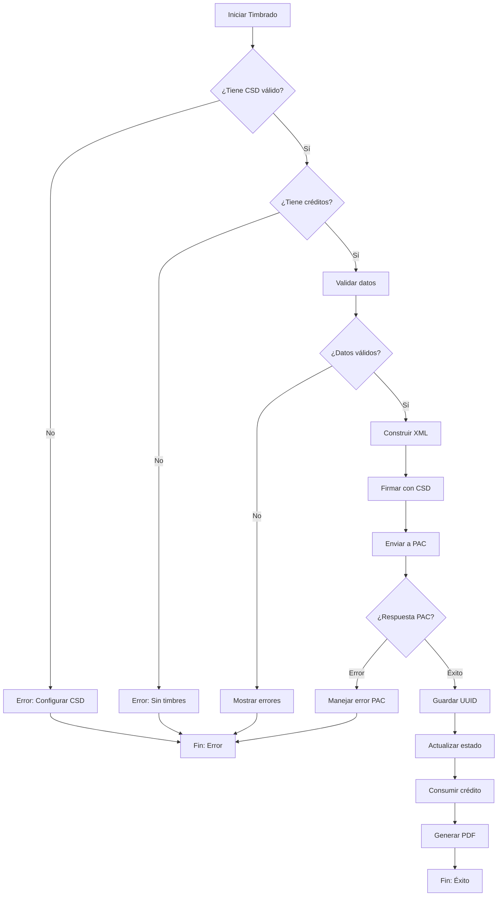
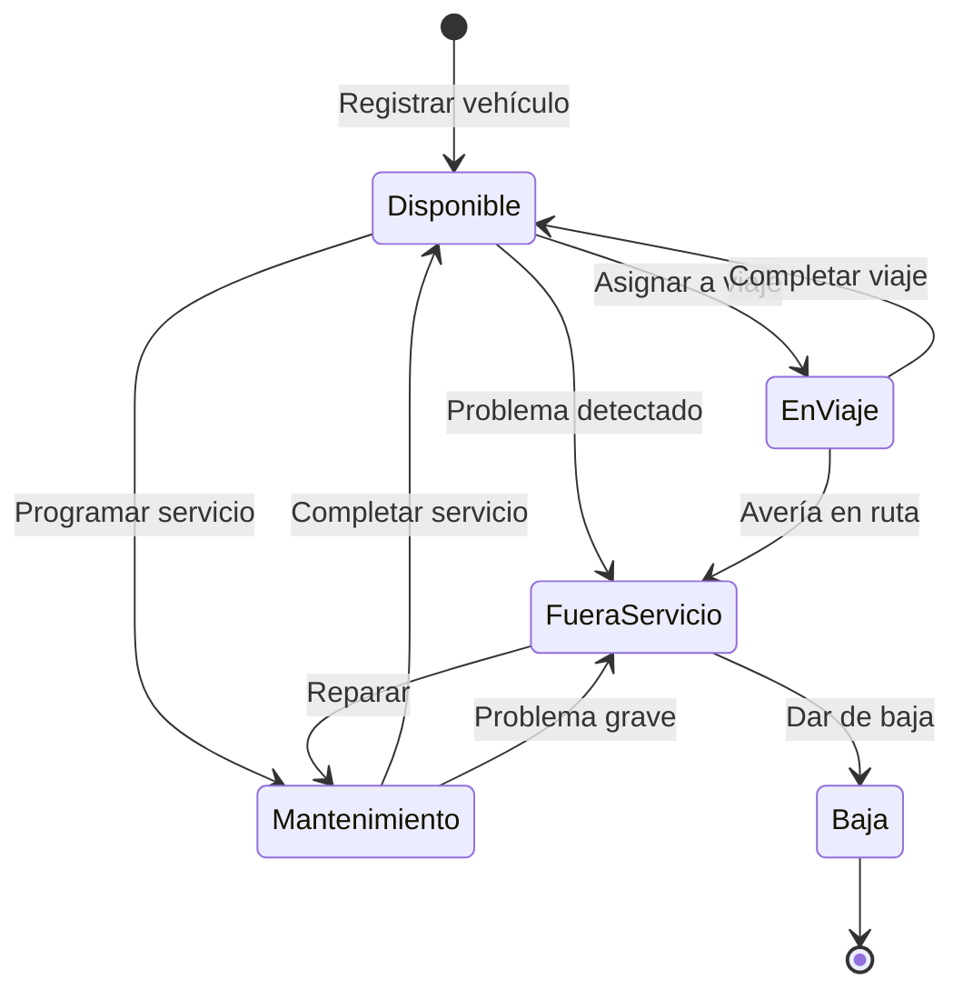
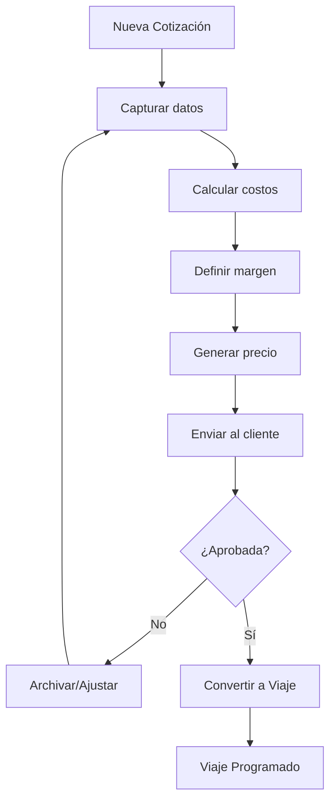
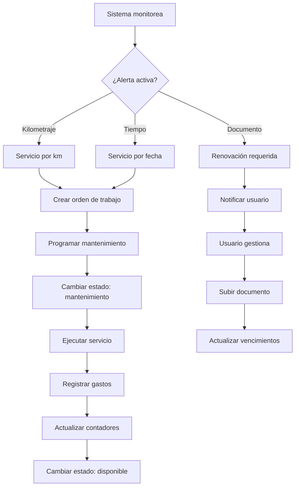
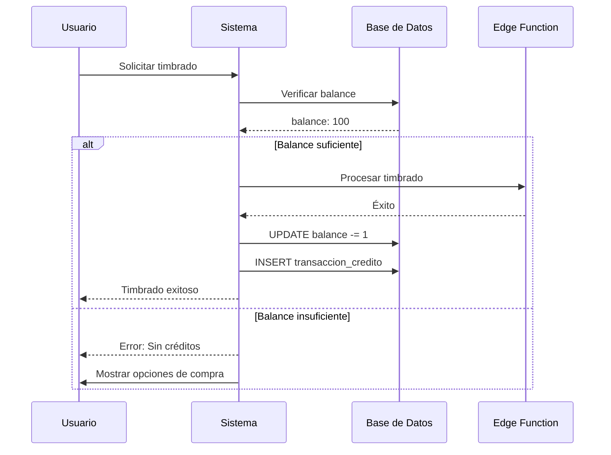
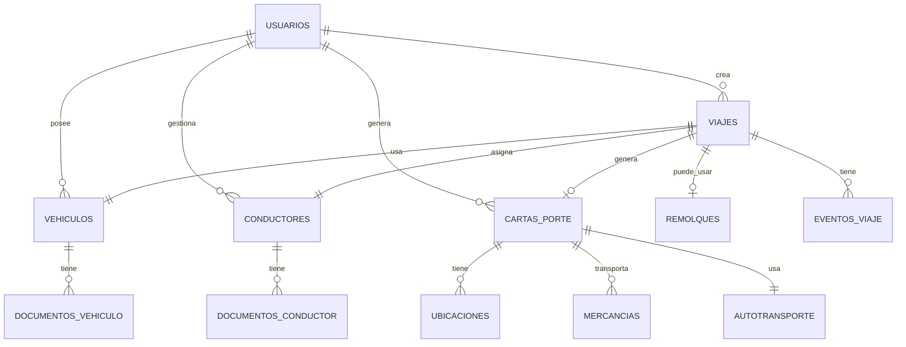

# 📊 Flujos de Negocio - Interconecta Trucking

Esta guía documenta los flujos de negocio principales del sistema con diagramas, estados y ejemplos prácticos.

## 📋 Tabla de Contenidos

- [Flujo Principal: Viaje → Factura → Carta Porte](#flujo-principal-viaje--factura--carta-porte)
- [Ciclo de Vida del Viaje](#ciclo-de-vida-del-viaje)
- [Proceso de Timbrado CFDI](#proceso-de-timbrado-cfdi)
- [Gestión de Flota](#gestión-de-flota)
- [Sistema de Cotizaciones](#sistema-de-cotizaciones)
- [Mantenimiento Preventivo](#mantenimiento-preventivo)
- [Sistema de Créditos](#sistema-de-créditos)

---

## Flujo Principal: Viaje → Factura → Carta Porte

### Diagrama de Secuencia



### Estados del Flujo

```
┌─────────────┐     ┌─────────────┐     ┌─────────────┐     ┌─────────────┐
│  COTIZACIÓN │────▶│    VIAJE    │────▶│   FACTURA   │────▶│ CARTA PORTE │
│  (opcional) │     │  programado │     │  (si flete) │     │   timbrada  │
└─────────────┘     └─────────────┘     └─────────────┘     └─────────────┘
                          │
                          ▼
                    ┌─────────────┐
                    │ en_transito │
                    └─────────────┘
                          │
                          ▼
                    ┌─────────────┐
                    │ completado  │
                    └─────────────┘
```

---

## Ciclo de Vida del Viaje

### Diagrama de Estados



### Tabla de Estados

| Estado | Descripción | Acciones Permitidas | Siguiente Estado |
|--------|-------------|---------------------|------------------|
| `programado` | Viaje creado, pendiente de inicio | Editar, Iniciar, Cancelar | `en_transito`, `cancelado` |
| `en_transito` | Viaje en curso | Actualizar ubicación, Reportar incidente, Completar | `completado`, `retrasado`, `cancelado` |
| `retrasado` | Viaje con retraso detectado | Actualizar ETA, Resolver, Completar | `en_transito`, `completado` |
| `completado` | Carga entregada exitosamente | Generar reportes, Ver historial | - |
| `cancelado` | Viaje cancelado | Ver motivo | - |

### Eventos del Viaje

Cada cambio de estado genera un evento en `eventos_viaje`:

```typescript
interface EventoViaje {
  id: string;
  viaje_id: string;
  tipo_evento: 'inicio' | 'parada' | 'retraso' | 'incidente' | 'entrega' | 'cancelacion';
  timestamp: string;
  ubicacion?: {
    lat: number;
    lng: number;
    direccion: string;
  };
  descripcion: string;
  metadata?: Record<string, any>;
}
```

### Ejemplo: Flujo Completo de un Viaje

```typescript
// 1. Crear viaje desde wizard
const viaje = await crearViaje({
  cliente_id: 'uuid-cliente',
  conductor_id: 'uuid-conductor',
  vehiculo_id: 'uuid-vehiculo',
  remolque_id: 'uuid-remolque',
  origen: 'Ciudad de México',
  destino: 'Monterrey',
  fecha_inicio_programada: '2024-01-15T08:00:00Z',
  tracking_data: {
    ubicaciones: [ubicacionOrigen, ubicacionDestino],
    mercancias: [mercancia1, mercancia2]
  }
});
// Estado: programado

// 2. Iniciar viaje
await actualizarEstado(viaje.id, 'en_transito');
// Evento: { tipo: 'inicio', timestamp: now() }

// 3. Registrar parada (opcional)
await registrarEvento({
  viaje_id: viaje.id,
  tipo_evento: 'parada',
  descripcion: 'Carga de combustible',
  ubicacion: { lat: 21.88, lng: -102.29 }
});

// 4. Completar viaje
await actualizarEstado(viaje.id, 'completado');
// Evento: { tipo: 'entrega', timestamp: now() }

// 5. Generar carta porte timbrada
const resultado = await timbrarCartaPorte({
  viajeId: viaje.id,
  ambiente: 'production'
});
```

---

## Proceso de Timbrado CFDI

### Diagrama de Flujo de Timbrado



### Estructura del XML CFDI 4.0 con Carta Porte 3.1

```xml
<?xml version="1.0" encoding="UTF-8"?>
<cfdi:Comprobante 
    xmlns:cfdi="http://www.sat.gob.mx/cfd/4"
    xmlns:cartaporte31="http://www.sat.gob.mx/CartaPorte31"
    Version="4.0"
    TipoDeComprobante="T"
    ...>
    
    <cfdi:Emisor ... />
    <cfdi:Receptor ... />
    
    <cfdi:Conceptos>
        <cfdi:Concepto 
            ClaveProdServ="78101800"
            Descripcion="Servicios de transporte de carga"
            .../>
    </cfdi:Conceptos>
    
    <cfdi:Complemento>
        <cartaporte31:CartaPorte
            Version="3.1"
            TranspInternac="No"
            TotalDistRec="900">
            
            <cartaporte31:Ubicaciones>
                <cartaporte31:Ubicacion TipoUbicacion="Origen" ... />
                <cartaporte31:Ubicacion TipoUbicacion="Destino" ... />
            </cartaporte31:Ubicaciones>
            
            <cartaporte31:Mercancias 
                PesoBrutoTotal="15000"
                NumTotalMercancias="2">
                <cartaporte31:Mercancia ... />
            </cartaporte31:Mercancias>
            
            <cartaporte31:Autotransporte>
                <cartaporte31:IdentificacionVehicular ... />
                <cartaporte31:Seguros ... />
                <cartaporte31:Remolques>
                    <cartaporte31:Remolque ... />
                </cartaporte31:Remolques>
            </cartaporte31:Autotransporte>
            
            <cartaporte31:FiguraTransporte>
                <cartaporte31:TiposFigura ... />
            </cartaporte31:FiguraTransporte>
            
        </cartaporte31:CartaPorte>
    </cfdi:Complemento>
    
</cfdi:Comprobante>
```

### Validaciones Pre-Timbrado

| Campo | Validación | Error si falla |
|-------|------------|----------------|
| RFC Emisor | Formato válido, longitud correcta | RFC_EMISOR_INVALIDO |
| RFC Receptor | Formato válido | RFC_RECEPTOR_INVALIDO |
| Ubicaciones | Mínimo 2 (origen + destino) | UBICACIONES_INSUFICIENTES |
| Mercancías | Al menos 1 mercancía | SIN_MERCANCIAS |
| Peso Total | > 0 y <= capacidad vehículo | PESO_INVALIDO |
| Vehículo | Config vehicular válida | VEHICULO_INVALIDO |
| Conductor | Licencia vigente | LICENCIA_VENCIDA |

---

## Gestión de Flota

### Diagrama de Estados del Vehículo



### Documentos del Vehículo

```typescript
interface DocumentoVehiculo {
  tipo: 'tarjeta_circulacion' | 'poliza_seguro' | 'verificacion' | 'permiso_sct';
  fecha_emision: string;
  fecha_vencimiento: string;
  archivo_url: string;
  estado: 'vigente' | 'por_vencer' | 'vencido';
}

// Alerta automática cuando:
// - 30 días antes de vencer: warning
// - 15 días antes: error (bloquea asignación a viajes)
// - Vencido: fuera_servicio automático
```

### Flujo de Asignación

```
┌─────────────┐     ┌─────────────┐     ┌─────────────┐
│   Vehículo  │────▶│  Validar    │────▶│   Asignar   │
│  Disponible │     │  Documentos │     │   a Viaje   │
└─────────────┘     └─────────────┘     └─────────────┘
                          │
                          ▼
                    ┌─────────────┐
                    │  ¿Válidos?  │
                    └─────────────┘
                      │       │
                    Sí│       │No
                      ▼       ▼
              ┌─────────┐  ┌─────────────┐
              │ Asignar │  │ Bloquear +  │
              │         │  │ Notificar   │
              └─────────┘  └─────────────┘
```

---

## Sistema de Cotizaciones

### Flujo de Cotización a Viaje



### Estructura de Costos

```typescript
interface CostosInternos {
  // Costos operativos
  combustible: number;      // Estimado por km y rendimiento
  casetas: number;          // Según ruta calculada
  peajes: number;           // Peajes adicionales
  
  // Costos de personal
  salario_conductor: number;
  viaticos: number;
  
  // Costos fijos prorrateados
  mantenimiento: number;    // % del viaje
  seguro: number;           // % del viaje
  depreciacion: number;     // % del viaje
  
  // Administrativos
  comisiones: number;
  otros: number;
}

// Cálculo del precio
const costoTotal = Object.values(costos).reduce((a, b) => a + b, 0);
const precioFinal = costoTotal * (1 + margenGanancia / 100);
```

---

## Mantenimiento Preventivo

### Diagrama de Mantenimiento



### Tipos de Mantenimiento

| Tipo | Trigger | Acciones |
|------|---------|----------|
| Preventivo | Cada 10,000 km | Cambio de aceite, filtros |
| Periódico | Cada 6 meses | Revisión general |
| Correctivo | Falla detectada | Reparación específica |
| Documental | 30 días antes | Renovar documentos |

---

## Sistema de Créditos

### Flujo de Consumo de Créditos



### Estructura de Créditos

```typescript
interface CreditosUsuario {
  id: string;
  user_id: string;
  balance_disponible: number;
  total_comprados: number;
  total_consumidos: number;
  timbres_mes_actual: number;
  fecha_renovacion: string;
}

interface TransaccionCredito {
  id: string;
  user_id: string;
  tipo: 'compra' | 'consumo' | 'bonificacion' | 'ajuste';
  cantidad: number;
  balance_anterior: number;
  balance_nuevo: number;
  concepto: string;
  referencia_id?: string; // ID del CFDI timbrado
  created_at: string;
}
```

### Renovación Mensual

```
┌─────────────────────────────────────────────────────────────┐
│                   PROCESO DE RENOVACIÓN                      │
├─────────────────────────────────────────────────────────────┤
│  1. Cron job ejecuta renovar-timbres-mensuales              │
│  2. Para cada suscripción activa:                           │
│     a. Verificar fecha de renovación                        │
│     b. Agregar timbres según plan                           │
│     c. Resetear contador mensual                            │
│     d. Registrar transacción                                │
│  3. Enviar notificación al usuario                          │
└─────────────────────────────────────────────────────────────┘

Planes y timbres:
- Básico: 50 timbres/mes
- Profesional: 200 timbres/mes  
- Empresarial: 500 timbres/mes
- Ilimitado: Sin límite
```

---

## Diagrama de Arquitectura de Datos



---

## Resumen de Interacciones

| Módulo | Afecta a | Eventos generados |
|--------|----------|-------------------|
| Viajes | Conductores, Vehículos, Cartas Porte | `viaje_creado`, `viaje_iniciado`, `viaje_completado` |
| Cartas Porte | Viajes, Créditos | `carta_porte_creada`, `carta_porte_timbrada` |
| Vehículos | Viajes, Mantenimiento | `vehiculo_asignado`, `documento_vencido` |
| Conductores | Viajes | `conductor_asignado`, `licencia_vencida` |
| Créditos | Cartas Porte, Facturas | `credito_consumido`, `creditos_agotados` |

---

## Checklist de Implementación

### Para nuevo viaje:
- [ ] Cliente seleccionado
- [ ] Origen con dirección completa
- [ ] Destino con dirección completa
- [ ] Al menos 1 mercancía
- [ ] Vehículo disponible asignado
- [ ] Conductor disponible asignado
- [ ] Fechas de inicio/fin definidas

### Para timbrar carta porte:
- [ ] Viaje en estado `programado` o `en_transito`
- [ ] CSD válido y vigente
- [ ] Créditos disponibles
- [ ] RFC emisor válido
- [ ] RFC receptor válido
- [ ] Ubicaciones completas con claves SAT
- [ ] Mercancías con claves de producto
- [ ] Vehículo con configuración vehicular SAT
- [ ] Conductor con licencia vigente

### Para completar viaje:
- [ ] Carta porte timbrada (si aplica)
- [ ] Evidencia de entrega (opcional)
- [ ] Costos reales capturados (opcional)
