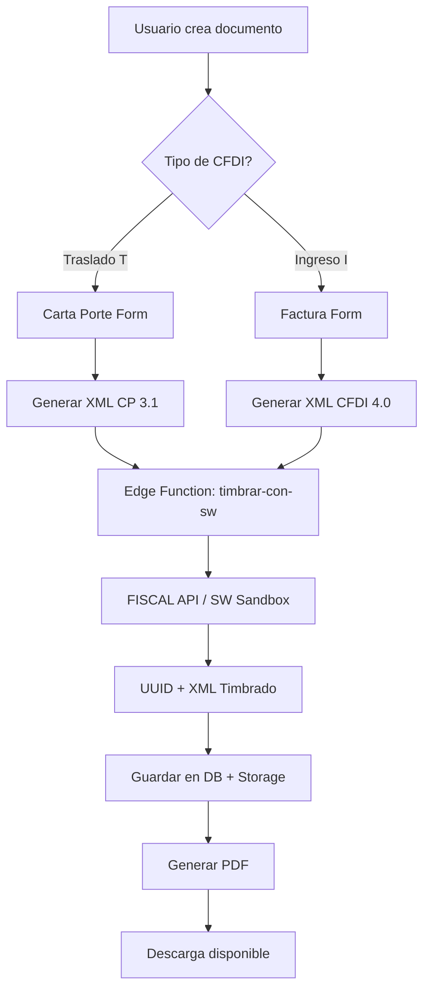

# 📦 Guía: Carta Porte vs Factura - ¿Cuándo usar cada una?

## 🎯 Conceptos Clave

### CFDI de Traslado (Carta Porte)
**Propósito**: Amparar el **transporte de mercancías** en territorio nacional.

- ✅ **Tipo de Comprobante**: `T` (Traslado)
- 📄 **Complemento Obligatorio**: Carta Porte 3.1
- 💰 **Subtotal/Total**: **$0.00** (no hay cobro)
- 🚚 **Uso**: Documentar el **movimiento físico** de mercancías

**Ejemplo Real**:
```
Transportas 5,000 kg de maíz desde Guadalajara a CDMX.
- RFC Emisor: Tu empresa transportista
- RFC Receptor: Cliente que recibe la mercancía
- Subtotal: $0.00
- Total: $0.00
- Complemento: Carta Porte con ubicaciones, mercancías, vehículo, operador
```

---

### CFDI de Ingreso (Factura con Carta Porte)
**Propósito**: **Facturar** el servicio de transporte que prestas.

- ✅ **Tipo de Comprobante**: `I` (Ingreso)
- 📄 **Complemento Opcional**: Carta Porte 3.1 (si quieres vincular ruta)
- 💰 **Subtotal/Total**: **> $0.00** (cobras por el servicio)
- 💼 **Uso**: Documentar el **cobro** del servicio de transporte

**Ejemplo Real**:
```
Cobras $8,500 + IVA por transportar las 5,000 kg de maíz.
- RFC Emisor: Tu empresa transportista
- RFC Receptor: Cliente que te paga
- Subtotal: $8,500.00
- IVA (16%): $1,360.00
- Total: $9,860.00
- Complemento: Carta Porte (opcional) para vincular con el traslado
```

---

## 🔄 Flujo Actual en Interconecta

### 1️⃣ Crear Carta Porte (CFDI de Traslado)
```
Usuario → Crear Carta Porte → Llenar formulario → Generar XML → Timbrar con SW/Conectia
```

**Resultado**: XML timbrado con UUID + PDF descargable

**Estado en DB**: `cartas_porte.status = 'timbrado'`

---

### 2️⃣ Crear Factura (CFDI de Ingreso) - **PRÓXIMAMENTE**
```
Usuario → Crear Factura → Agregar conceptos (servicios) → Calcular totales → Vincular CP (opcional) → Timbrar
```

**Resultado**: Factura timbrada con UUID + PDF + vinculación con CP

**Estado en DB**: 
- `facturas.status = 'timbrado'`
- `facturas.carta_porte_id = uuid` (si se vinculó)
- `cartas_porte.factura_id = uuid` (referencia inversa)

---

## 🆚 Comparativa Rápida

| Característica | CFDI Traslado (Carta Porte) | CFDI Ingreso (Factura + CP) |
|---|---|---|
| **Tipo Comprobante** | `T` | `I` |
| **Subtotal/Total** | $0.00 | > $0.00 |
| **IVA** | ❌ No aplica | ✅ Sí aplica (16%) |
| **Uso Principal** | Amparar transporte | Cobrar servicio |
| **Complemento CP** | ✅ Obligatorio | 🟡 Opcional |
| **UUID SAT** | ✅ Sí (generado por PAC) | ✅ Sí (generado por PAC) |
| **Requisitos SAT** | Ubicaciones, mercancías, figuras | Emisor, receptor, conceptos, impuestos |

---

## 🎬 Casos de Uso Reales

### Caso 1: Solo Transporte (No Cobras)
**Situación**: Mueves mercancía entre almacenes propios

✅ **Solución**: CFDI de Traslado (Carta Porte)
- Tipo: `T`
- Total: $0.00
- Complemento: Carta Porte 3.1

---

### Caso 2: Servicio de Transporte Pagado
**Situación**: Cliente te paga $10,000 + IVA por transportar su mercancía

✅ **Solución**: CFDI de Ingreso (Factura) + Carta Porte
1. Crear CFDI de Ingreso (`I`)
   - Concepto: "Servicio de transporte de carga"
   - Subtotal: $10,000
   - IVA: $1,600
   - Total: $11,600
2. Vincular Carta Porte existente (opcional)

---

### Caso 3: Transporte + Factura Inmediata
**Situación**: Quieres documentar el traslado Y facturar en un solo paso

✅ **Solución**: CFDI de Ingreso con Complemento Carta Porte
- Tipo: `I`
- Subtotal: $X,XXX.XX
- Total: $X,XXX.XX + IVA
- Complemento: Carta Porte 3.1 incluido

---

## 🏗️ Arquitectura Técnica

### Base de Datos
```sql
-- Tabla de Cartas Porte (CFDI Traslado)
cartas_porte (
  id, uuid_fiscal, tipo_cfdi = 'T', status, xml_generado,
  factura_id → facturas.id  -- Vinculación opcional con factura
)

-- Tabla de Facturas (CFDI Ingreso/Egreso)
facturas (
  id, uuid_fiscal, tipo_comprobante = 'I', subtotal, total, status,
  carta_porte_id → cartas_porte.id  -- Vinculación opcional con CP
)
```

### Flujo de Timbrado


---

## ✅ Recomendaciones SAT

1. **Siempre generar Carta Porte** si transportas mercancías físicamente
2. **Facturar con Ingreso** si cobras por el servicio
3. **Vincular ambos** para trazabilidad fiscal completa
4. **Conservar XMLs** mínimo 5 años (obligación fiscal)
5. **Usar UUID correcto** en cada documento

---

## 🚀 Estado Actual del MVP

| Funcionalidad | Estado | Notas |
|---|---|---|
| CFDI Traslado (CP) | ✅ Implementado | Timbrado con SW/Conectia funcional |
| Generación XML CP 3.1 | ✅ Implementado | Cumple esquema SAT |
| PDF Carta Porte | ✅ Implementado | Descarga profesional |
| Timbrado SW Sandbox | ✅ Implementado | Edge function operativa |
| CFDI Ingreso (Factura) | 🟡 En desarrollo | UI creada, falta timbrado |
| Vinculación CP ↔ Factura | 🟡 En desarrollo | Modelo DB listo |
| Timbrado Factura | ❌ Pendiente | Reutilizar edge function |
| PDF Factura | ❌ Pendiente | Adaptar generador actual |

---

## 📞 Soporte Técnico

- **Documentación SAT**: [Carta Porte 3.1](http://omawww.sat.gob.mx/tramitesyservicios/Paginas/complemento_carta_porte.htm)
- **Edge Function**: `supabase/functions/timbrar-con-sw/index.ts`
- **Generador XML**: `src/services/xml/XMLCartaPorteGenerator.ts`
- **PAC Provider**: SW/Conectia (Sandbox/Producción)

---

**Última actualización**: 2025-01-12  
**Versión Carta Porte**: 3.1  
**Versión CFDI**: 4.0
