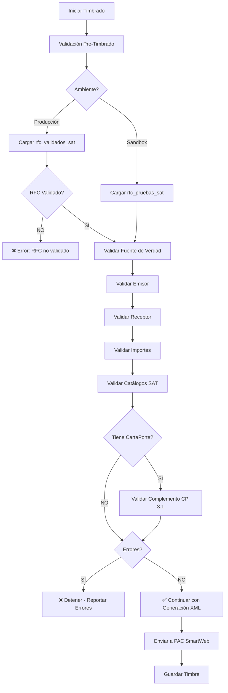

# Integración Fiscal - CFDI 4.0 + CartaPorte 3.1

## 📋 Descripción General

Sistema de validación fiscal 100% apegado a:
- **Anexo 20 del SAT** (Catálogos CFDI 4.0)
- **Complemento CartaPorte 3.1**
- **Especificaciones del PAC SmartWeb**
- **Normatividad fiscal mexicana vigente**

**ZERO autocorrecciones** - Sistema auditableque solo valida y reporta inconsistencias.

---

## 🔐 Fuentes de Datos Oficiales

### Ambiente SANDBOX (Pruebas)

**Tabla:** `rfc_pruebas_sat`

| Campo | Valor Ejemplo | Descripción |
|-------|---------------|-------------|
| `rfc` | EKU9003173C9 | RFC oficial de prueba SAT |
| `nombre` | ESCUELA KEMPER URGATE | Nombre registrado en SAT |
| `regimen_fiscal` | 601 | General de Ley Personas Morales |
| `codigo_postal` | 86035 | CP del domicilio fiscal |

**Validación:** Datos oficiales del SAT, **NO MODIFICABLES**

### Ambiente PRODUCCIÓN

**Tabla Principal:** `configuracion_empresa`  
**Tabla de Cache:** `rfc_validados_sat`

| Campo | Fuente | Validación |
|-------|--------|-----------|
| `rfc_emisor` | configuracion_empresa | Validado contra padrón SAT |
| `razon_social` | rfc_validados_sat.razon_social_sat | Debe coincidir EXACTAMENTE |
| `regimen_fiscal` | configuracion_empresa | Del catálogo c_RegimenFiscal |
| `codigo_postal` | configuracion_empresa.domicilio_fiscal | 5 dígitos |

**Validación:** Requiere `validado_sat = true` con vigencia de 30 días

---

## 📝 Mapeo Completo de Campos CFDI 4.0

### Nodo Raíz: Comprobante

| Atributo XML | Fuente de Datos | Validación | Catálogo SAT |
|--------------|----------------|------------|--------------|
| `Version` | Constante: "4.0" | Requerido | N/A |
| `Serie` | `configuracion_empresa.serie_factura` | Max 25 chars | N/A |
| `Folio` | `configuracion_empresa.folio_actual_factura` | Secuencial | N/A |
| `Fecha` | `new Date()` | Formato: YYYY-MM-DDTHH:MM:SS | N/A |
| `SubTotal` | `facturas.subtotal` | Numérico, 2 decimales | N/A |
| `Descuento` | `facturas.descuento` | Opcional, 2 decimales | N/A |
| `Moneda` | `facturas.moneda` | ISO 4217 | c_Moneda |
| `TipoCambio` | `facturas.tipo_cambio` | Req. si Moneda ≠ MXN | N/A |
| `Total` | `facturas.total` | Numérico, 2 decimales | N/A |
| `TipoDeComprobante` | `facturas.tipo_comprobante` | I, E, T, N, P | c_TipoDeComprobante |
| `Exportacion` | "01" | No aplica exportación | c_Exportacion |
| `MetodoPago` | `facturas.metodo_pago` | PUE o PPD | c_MetodoPago |
| `FormaPago` | `facturas.forma_pago` | 01-99 | c_FormaPago |
| `LugarExpedicion` | `configuracion_empresa.domicilio_fiscal.codigo_postal` | 5 dígitos | N/A |

### Nodo: Emisor

| Atributo XML | Fuente de Datos | Validación CRÍTICA |
|--------------|----------------|-------------------|
| `Rfc` | Sandbox: `rfc_pruebas_sat.rfc`<br>Producción: `configuracion_empresa.rfc_emisor` | **DEBE coincidir con certificado digital** |
| `Nombre` | Sandbox: `rfc_pruebas_sat.nombre`<br>Producción: `rfc_validados_sat.razon_social_sat` | **DEBE coincidir EXACTAMENTE con padrón SAT**<br>❌ Error CFDI40139 si difiere |
| `RegimenFiscal` | `configuracion_empresa.regimen_fiscal` | Del catálogo c_RegimenFiscal (601, 612, 626, etc.) |

### Nodo: Receptor

| Atributo XML | Fuente de Datos | Validación |
|--------------|----------------|-----------|
| `Rfc` | `facturas.rfc_receptor` | Formato RFC válido (12-13 chars) |
| `Nombre` | `facturas.nombre_receptor` | Texto, max 254 chars |
| `DomicilioFiscalReceptor` | `facturas.domicilio_fiscal_receptor` | CP de 5 dígitos |
| `RegimenFiscalReceptor` | `facturas.regimen_fiscal_receptor` | Del catálogo c_RegimenFiscal |
| `UsoCFDI` | `facturas.uso_cfdi` | Del catálogo c_UsoCFDI |

---

## 🚚 Complemento CartaPorte 3.1

### Ubicaciones (Mínimo 2: Origen y Destino)

**Fuente:** `borradores_carta_porte.datos_formulario.ubicaciones[]`

| Campo | Validación | Descripción |
|-------|-----------|-------------|
| `TipoUbicacion` | Requerido | "Origen" o "Destino" |
| `RFCRemitenteDestinatario` | Formato RFC | RFC del remitente/destinatario |
| `FechaHoraSalidaLlegada` | Formato SAT | YYYY-MM-DDTHH:MM:SS |
| `DistanciaRecorrida` | Numérico km | Solo en destino final |
| `Domicilio.CodigoPostal` | 5 dígitos | Código postal válido |
| `Domicilio.Estado` | Catálogo | c_Estado |
| `Domicilio.Pais` | Catálogo | c_Pais (default: MEX) |

### Mercancías (Mínimo 1)

**Fuente:** `borradores_carta_porte.datos_formulario.mercancias[]`

| Campo | Validación | Descripción |
|-------|-----------|-------------|
| `BienesTransp` | Catálogo | c_ClaveProdServCP |
| `ClaveUnidad` | Catálogo | c_ClaveUnidad |
| `Descripcion` | Texto | Descripción de la mercancía |
| `Cantidad` | Numérico | Cantidad transportada |
| `PesoEnKg` | Numérico | Peso bruto en kilogramos |
| `ValorMercancia` | Numérico | Valor declarado |
| `Moneda` | Catálogo | c_Moneda (default: MXN) |

### Autotransporte (Requerido)

**Fuente:** `borradores_carta_porte.datos_formulario.autotransporte`

| Campo | Validación | Descripción |
|-------|-----------|-------------|
| `PermSCT` | Catálogo | c_TipoPermiso |
| `NumPermisoSCT` | Texto | Número de permiso SCT |
| `ConfigVehicular` | Catálogo | c_ConfigAutotransporte |
| `PesoBrutoVehicular` | Numérico | Peso en kg |
| `PlacaVM` | Texto | Placa del vehículo motor |
| `AnioModeloVM` | Numérico | Año del vehículo (YYYY) |

### Figuras de Transporte (Mínimo 1 Operador)

**Fuente:** `borradores_carta_porte.datos_formulario.figuras[]`

| Campo | Validación | Descripción |
|-------|-----------|-------------|
| `TipoFigura` | "01" | 01 = Operador |
| `RFCFigura` | Formato RFC | RFC del operador |
| `NombreFigura` | Texto | Nombre completo |
| `NumLicencia` | Texto | Número de licencia |

---

## 📊 Catálogos SAT Oficiales

### c_FormaPago (Forma de Pago)

| Código | Descripción |
|--------|-------------|
| 01 | Efectivo |
| 02 | Cheque nominativo |
| 03 | Transferencia electrónica de fondos |
| 04 | Tarjeta de crédito |
| 05 | Monedero electrónico |
| 06 | Dinero electrónico |
| 28 | Tarjeta de débito |
| 99 | Por definir |

[Catálogo completo](http://omawww.sat.gob.mx/tramitesyservicios/Paginas/documentos/c_FormaPago.xls)

### c_MetodoPago (Método de Pago)

| Código | Descripción |
|--------|-------------|
| PUE | Pago en una sola exhibición |
| PPD | Pago en parcialidades o diferido |

### c_Moneda (Monedas - ISO 4217)

| Código | Descripción |
|--------|-------------|
| MXN | Peso Mexicano |
| USD | Dólar estadounidense |
| EUR | Euro |
| XXX | Los códigos asignados para las transacciones en que intervenga ninguna moneda |

### c_UsoCFDI (Uso del CFDI)

| Código | Descripción |
|--------|-------------|
| G01 | Adquisición de mercancías |
| G02 | Devoluciones, descuentos o bonificaciones |
| G03 | Gastos en general |
| S01 | Sin efectos fiscales |
| CP01 | Pagos |
| I01-I08 | Inversiones (construcciones, equipo, etc.) |
| D01-D10 | Deducciones personales |

[Catálogo completo](http://omawww.sat.gob.mx/tramitesyservicios/Paginas/documentos/c_UsoCFDI.xls)

### c_RegimenFiscal (Régimen Fiscal)

| Código | Descripción |
|--------|-------------|
| 601 | General de Ley Personas Morales |
| 605 | Sueldos y Salarios e Ingresos Asimilados a Salarios |
| 606 | Arrendamiento |
| 612 | Personas Físicas con Actividades Empresariales y Profesionales |
| 616 | Sin obligaciones fiscales |
| 626 | Régimen Simplificado de Confianza |

[Catálogo completo](http://omawww.sat.gob.mx/tramitesyservicios/Paginas/documentos/c_RegimenFiscal.xls)

---

## 🔍 Flujo de Validación Fiscal



---

## ⚠️ Errores Críticos del SAT

### CFDI40139 - Nombre del Emisor No Coincide

**Causa:** El campo `Nombre` del emisor no coincide EXACTAMENTE con el registrado en el SAT.

**Prevención:**
1. Sandbox: Usar SIEMPRE el nombre de `rfc_pruebas_sat`
2. Producción: Validar contra `rfc_validados_sat.razon_social_sat`
3. NO permitir edición manual del nombre en `facturas.nombre_emisor`

**Solución:**
```sql
-- Actualizar nombre emisor con datos oficiales
UPDATE facturas
SET nombre_emisor = (
  SELECT razon_social_sat
  FROM rfc_validados_sat
  WHERE rfc = facturas.rfc_emisor
  LIMIT 1
)
WHERE user_id = 'USER_ID';
```

### CFDI40109 - Importes Inválidos para Tipo T o P

**Causa:** TipoDeComprobante "T" (Traslado) o "P" (Pago) requiere SubTotal y Total en 0.00

**Prevención:**
- Si es Traslado (sin cobro): `tipo_comprobante = 'T'`, `subtotal = 0`, `total = 0`
- Si es Ingreso (con cobro): `tipo_comprobante = 'I'`, `subtotal > 0`, `total > 0`

---

## 🛡️ Reglas de Seguridad

### ✅ Permitido

- ✅ Leer datos de fuentes oficiales (`rfc_pruebas_sat`, `rfc_validados_sat`)
- ✅ Validar contra catálogos SAT
- ✅ Reportar errores con detalle campo, valor actual, esperado y fuente
- ✅ Detener proceso si hay inconsistencias

### ❌ Prohibido

- ❌ Autocorregir datos sin autorización del usuario
- ❌ Modificar silenciosamente valores fiscales
- ❌ Asumir datos cuando faltan
- ❌ Usar valores por defecto no autorizados
- ❌ Continuar timbrado con errores críticos

---

## 📚 Referencias Oficiales

### SAT (Servicio de Administración Tributaria)

- [Anexo 20 - Guía de llenado CFDI](http://omawww.sat.gob.mx/tramitesyservicios/Paginas/anexo_20.htm)
- [Catálogos CFDI 4.0](http://omawww.sat.gob.mx/tramitesyservicios/Paginas/catalogos_emision_cfdi_complemento_ce.htm)
- [Complemento CartaPorte 3.1](http://omawww.sat.gob.mx/cartaporte/Paginas/documentos/PF_Complemento_Carta_Porte.pdf)
- [Validador XML SAT](https://www.sat.gob.mx/aplicacion/operacion/31274/verifica-tus-comprobantes-digitales)

### PAC SmartWeb

- [Documentación API](https://developers.sw.com.mx/)
- [Ambientes de Prueba](https://developers.sw.com.mx/knowledge-base/ambientes/)
- [Catálogo de Errores](https://developers.sw.com.mx/knowledge-base/errores-comunes/)

---

## 🔧 Mantenimiento

### Actualización de Catálogos SAT

Los catálogos del SAT se actualizan periódicamente. Verificar en:
- `src/services/validacion/ValidadorFiscalCompleto.ts`
- `src/utils/satValidators.ts`

**Frecuencia recomendada:** Trimestral

### Renovación de Validaciones SAT

Las validaciones en `rfc_validados_sat` tienen vigencia de 30 días.

**Proceso automático:** 
- Ejecutar `SATValidationService.validarRFCEnSAT()` cada 30 días
- Notificar al usuario si la validación expira
- Requerir revalidación antes de timbrar

---

## 📞 Soporte

**Desarrollador Principal:** Sistema Lovable  
**Última Actualización:** 2025-11-24  
**Versión:** 1.0.0

---

## 📄 Licencia

Integración fiscal desarrollada conforme a normatividad SAT vigente.  
Uso exclusivo para emisión legal de CFDIs en México.
