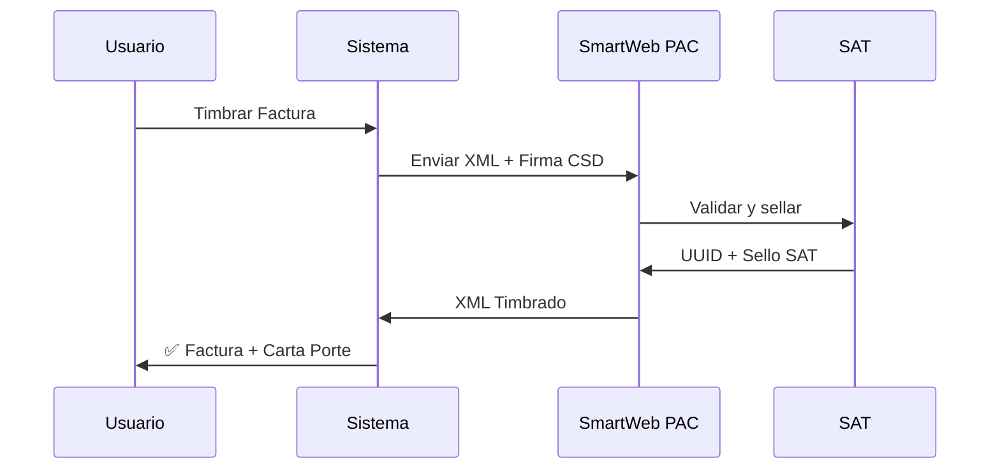
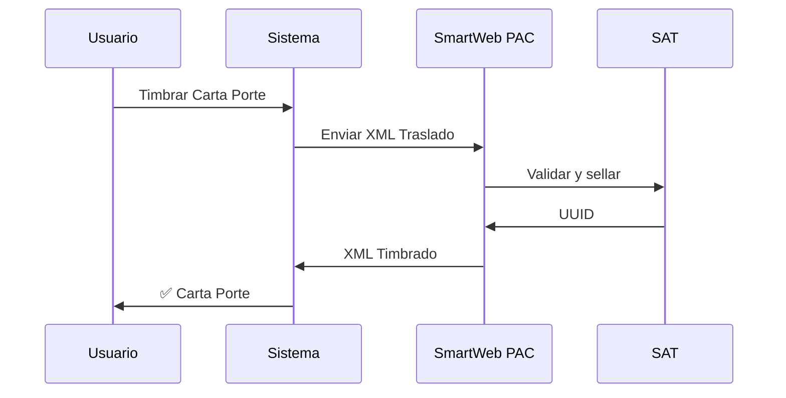

# 🚀 FLUJO COMPLETO MVP - SISTEMA DE TIMBRADO

## 📋 REQUISITOS PREVIOS

### 1️⃣ Crear Usuario
- Registro en `/auth`
- Confirmación de email
- Acceso al dashboard

### 2️⃣ Configurar Datos Fiscales
**Ruta:** `Administración > Configuración`

**Datos requeridos:**
- RFC Emisor (12-13 caracteres)
- Razón Social
- Régimen Fiscal (catálogo SAT)
- Domicilio Fiscal completo
- Código Postal (autocompleta estado/municipio)

**Validaciones:**
✅ RFC validado contra formato SAT  
✅ Código postal existe en catálogo  
✅ Régimen fiscal válido

---

### 3️⃣ Configurar Seguros (Opcional pero recomendado)
- Aseguradora Responsabilidad Civil
- Número de Póliza
- Aseguradora Medio Ambiente
- Vigencias

---

### 4️⃣ Subir Certificado CSD
**Ruta:** `Administración > Certificados Digitales`

**Archivos necesarios:**
- `.cer` (certificado público)
- `.key` (llave privada)
- Contraseña de la llave

**Validaciones:**
✅ Contraseña correcta (desencriptación real)  
✅ Vigencia del certificado  
✅ RFC coincide con configuración  
✅ NO es certificado de prueba (usuarios normales)

**Superusuarios:** Pueden usar certificados de prueba SAT

---

### 5️⃣ Crear Primera Unidad
**Ruta:** `Operaciones > Vehículos`

**Datos requeridos:**
- Placa
- Configuración vehicular (C2, C3, etc.)
- Año modelo
- Peso bruto vehicular
- Aseguradora y póliza
- Permisos SCT

---

### 6️⃣ Crear Primer Operador
**Ruta:** `Operaciones > Conductores`

**Datos requeridos:**
- Nombre completo
- RFC
- Licencia de conducir
- Vigencia de licencia

---

### 7️⃣ Crear Primer Remolque (Opcional)
**Ruta:** `Operaciones > Remolques`

---

### 8️⃣ Crear Primer Cliente
**Ruta:** `Clientes`

**Datos fiscales requeridos:**
- RFC Receptor
- Razón Social
- Régimen Fiscal
- Domicilio Fiscal
- Uso CFDI

---

### 9️⃣ Crear Primer Viaje
**Ruta:** `Viajes > Nuevo Viaje`

**Datos mapeados automáticamente:**
- Origen/Destino → Ubicaciones CartaPorte
- Mercancía → Conceptos Factura + Mercancías CP
- Conductor → Figura Transporte
- Vehículo → Autotransporte
- Cliente → Receptor
- Tipo servicio → Tipo Comprobante (I/T)

---

### 🔟 Generar Borrador y Validar
**Desde el viaje:**

1. Click "Ver Detalles"
2. Tab "Factura" → Validar datos
3. Tab "Carta Porte" → Validar complemento
4. Ajustar si es necesario

---

### 1️⃣1️⃣ Timbrar Documentos

#### **Para Flete Pagado (Ingreso):**


**Orden:**
1. Timbrar Factura (genera UUID)
2. Timbrar Carta Porte (relacionada con factura)

#### **Para Flete por Cobrar (Traslado):**


---

### 1️⃣2️⃣ Generar PDF
**Automático después del timbrado:**
- PDF Factura (si aplica)
- PDF Carta Porte
- Código QR con UUID
- Cadena original del complemento

---

### 1️⃣3️⃣ Descargar Documentos
**Formatos disponibles:**
- XML Timbrado
- PDF con sello SAT
- Código QR

---

### 1️⃣4️⃣ Consultar Estado SAT
**Ruta:** `Viajes > Detalles > Estado Fiscal`

**Información mostrada:**
- Estado del CFDI (Vigente/Cancelado)
- Estado de pago (si aplica)
- Fecha de cancelación

---

### 1️⃣5️⃣ Cancelar Factura (Si es necesario)
**Requisitos:**
- Motivo de cancelación (catálogo SAT)
- UUID de factura a sustituir (si aplica)

**Validación SAT:**
- Máximo 72 horas para cancelación sin aceptación del receptor
- Después requiere aceptación

---

## 🔐 AMBIENTES

### **Producción (Usuarios Normales)**
- `modo_pruebas = false`
- Certificado CSD real
- URLs SmartWeb producción
- Timbres válidos fiscalmente

### **Sandbox (Solo Superusuarios)**
- `modo_pruebas = true`
- Certificado CSD de prueba SAT permitido
- URLs SmartWeb sandbox
- Timbres SIN validez fiscal

---

## 🔄 ARQUITECTURA TÉCNICA

### **Determinación Dinámica del Ambiente**

El sistema usa el hook `useAmbienteTimbrado()` para determinar automáticamente el ambiente de timbrado:

```typescript
// src/hooks/useAmbienteTimbrado.ts
export const useAmbienteTimbrado = () => {
  // Lee modo_pruebas desde configuracion_empresa
  // Si modo_pruebas = true → 'sandbox'
  // Si modo_pruebas = false → 'production'
}
```

**Componentes que usan ambiente dinámico:**
- `ViajeTrackingModal.tsx`
- `ViajeDetalle.tsx`
- `FacturaEditor.tsx`
- `useTimbrado.ts`

### **Restricción de Modo Pruebas**

```sql
-- Función SQL para verificar permisos
CREATE OR REPLACE FUNCTION public.puede_usar_modo_pruebas(p_user_id UUID)
RETURNS BOOLEAN AS $$
BEGIN
  RETURN EXISTS (
    SELECT 1 FROM auth.users 
    WHERE id = p_user_id 
    AND (raw_user_meta_data->>'is_superuser')::boolean = true
  );
END;
$$ LANGUAGE plpgsql SECURITY DEFINER;
```

**Componente UI:**
- `DatosFiscalesModoPruebas.tsx` - Toggle visible solo para superusuarios

### **Validación de Certificados**

```typescript
// src/services/csd/CertificateParserService.ts
private static RFC_PRUEBA_SAT = [
  'EKU9003173C9', // Escuela Kemper Urgate
  'LAN7008173R5', // Lan Cargo
  'LAN8507268IA'  // Lanix
];

static esCertificadoDePrueba(rfc: string): boolean {
  return this.RFC_PRUEBA_SAT.includes(rfc.toUpperCase());
}
```

**Flujo de validación:**
1. Usuario sube certificado
2. Sistema extrae RFC del certificado
3. Verifica si es RFC de prueba SAT
4. Si es prueba y NO es superuser → RECHAZA
5. Si es prueba y SÍ es superuser → ACEPTA con advertencia

---

## ✅ CHECKLIST FINAL

- [ ] RFC validado en SAT
- [ ] Certificado CSD vigente y funcional
- [ ] Al menos 1 vehículo registrado
- [ ] Al menos 1 conductor registrado
- [ ] Al menos 1 cliente registrado
- [ ] Viaje con todos los datos completos
- [ ] Modo ambiente correcto (prod/sandbox)
- [ ] Primer timbrado exitoso

---

## 🧪 TESTING BETA

### **Escenarios de Prueba**

#### **Usuario Regular (Producción)**
1. ✅ Registro de cuenta
2. ✅ Configuración datos fiscales
3. ✅ Subir certificado CSD real
4. ✅ Crear entidades (vehículo, conductor, cliente)
5. ✅ Crear viaje completo
6. ✅ Timbrar en producción (SmartWeb PROD)
7. ✅ Descargar XML/PDF
8. ✅ Consultar estado SAT
9. ❌ NO puede ver toggle "Modo Pruebas"
10. ❌ NO puede subir certificados de prueba SAT

#### **Superusuario (Sandbox)**
1. ✅ Registro de cuenta con flag is_superuser
2. ✅ Configuración datos fiscales
3. ✅ Puede subir certificado de prueba SAT (EKU9003173C9)
4. ✅ Toggle "Modo Pruebas" visible y funcional
5. ✅ Activar modo_pruebas = true
6. ✅ Crear entidades con datos de prueba
7. ✅ Crear viaje de prueba
8. ✅ Timbrar en sandbox (SmartWeb SANDBOX)
9. ✅ Verificar UUID generado (válido en sandbox)
10. ⚠️ Advertencia: "Timbres sin validez fiscal"

#### **Cambio de Ambiente**
1. ✅ Superuser cambia de sandbox → producción
2. ✅ Sistema rechaza certificado de prueba en producción
3. ✅ Solicita certificado CSD real
4. ✅ Cambio de producción → sandbox
5. ✅ Modo pruebas se activa correctamente
6. ✅ Llamadas a PAC usan URLs correctas

---

## 🚨 ERRORES COMUNES

### **Error: "RFC no encontrado en el SAT"**
**Causa:** RFC del receptor no está activo en el padrón del SAT  
**Solución:** Verificar RFC en https://www.sat.gob.mx/aplicacion/login/43824/verifica-tu-informacion-fiscal

### **Error: "Certificado de prueba no permitido"**
**Causa:** Usuario regular intenta usar certificado SAT de prueba  
**Solución:** Subir certificado CSD real o contactar a administrador para permisos de superuser

### **Error: "Ambiente no configurado"**
**Causa:** `modo_pruebas` no está definido en `configuracion_empresa`  
**Solución:** Guardar configuración fiscal (inicializa `modo_pruebas = false` por defecto)

### **Error: "UUID inválido"**
**Causa:** Timbrado en sandbox pero se intenta validar en producción SAT  
**Solución:** Los UUIDs de sandbox NO son válidos en SAT producción

---

## 📞 SOPORTE TÉCNICO

### **Logs de Debugging**

```javascript
// Verificar ambiente actual
console.log('🌍 Ambiente de timbrado:', ambiente);

// Verificar certificado
console.log('📜 Certificado activo:', certificadoActivo);

// Verificar modo pruebas
console.log('🧪 Modo pruebas:', configuracion?.modo_pruebas);
```

### **Verificación en Base de Datos**

```sql
-- Ver configuración de usuario
SELECT 
  rfc_emisor,
  razon_social,
  modo_pruebas,
  proveedor_timbrado
FROM configuracion_empresa
WHERE user_id = '<user_id>';

-- Ver certificados activos
SELECT 
  nombre_certificado,
  rfc_titular,
  fecha_fin_vigencia,
  activo
FROM certificados_digitales
WHERE user_id = '<user_id>';

-- Verificar permisos superusuario
SELECT 
  email,
  raw_user_meta_data->>'is_superuser' as is_superuser
FROM auth.users
WHERE id = '<user_id>';
```

---

## 🎯 PRÓXIMOS PASOS POST-BETA

1. **Monitoreo de Timbrado**
   - Dashboard de timbres consumidos
   - Alertas de certificados próximos a vencer
   - Historial de errores de timbrado

2. **Integraciones Adicionales**
   - Envío automático de CFDIs por email
   - Integración con sistemas contables
   - API para clientes externos

3. **Optimizaciones**
   - Cache de catálogos SAT
   - Timbrado en lote
   - Pre-validación de XMLs

4. **Soporte Multi-Empresa**
   - Gestión de múltiples RFCs
   - Certificados por empresa
   - Facturación cross-entity

---

## 📚 RECURSOS ÚTILES

- [Documentación SmartWeb PAC](https://developers.sw.com.mx/)
- [Catálogos SAT CFDI 4.0](https://www.sat.gob.mx/consulta/16493/complemento-carta-porte)
- [Guía CartaPorte 3.1](http://omawww.sat.gob.mx/tramitesyservicios/Paginas/complemento_carta_porte.htm)
- [Validador SAT de RFCs](https://www.sat.gob.mx/aplicacion/login/43824/verifica-tu-informacion-fiscal)
- [Solicitud de Certificado CSD](https://www.sat.gob.mx/tramites/operacion/28993/obten-tu-certificado-de-sello-digital)

---

**Última actualización:** 2025-11-25  
**Versión del sistema:** MVP Beta v1.0  
**Proveedor PAC:** SmartWeb  
**Versiones soportadas:** CFDI 4.0 + CartaPorte 3.1
