# Flujo de Timbrado - Documentación Técnica

## 📋 Tipos de Documentos CFDI 4.0

### 1. Factura Simple (Tipo "I" - Ingreso)

**Uso:** Cuando se cobra por un servicio **SIN** transporte físico de mercancías.

**Características:**
- `TipoDeComprobante: "I"` (Ingreso)
- `SubTotal: > 0` (valor del servicio)
- `Total: > 0` (SubTotal + IVA)
- **NO** lleva Complemento CartaPorte

**Ejemplo:**
```json
{
  "TipoDeComprobante": "I",
  "SubTotal": "10000.00",
  "Total": "11600.00",
  "Conceptos": [{
    "Descripcion": "Servicio de consultoría",
    "ValorUnitario": "10000.00"
  }]
}
```

---

### 2. Factura con CartaPorte (Tipo "I" - Ingreso)

**Uso:** Cuando se cobra por un servicio **DE** transporte de carga.

**Características:**
- `TipoDeComprobante: "I"` (Ingreso)
- `SubTotal: > 0` (valor del servicio de transporte)
- `Total: > 0` (SubTotal + IVA)
- **SÍ** lleva Complemento CartaPorte (ubicaciones, mercancías, vehículo, conductor)

**Ejemplo:**
```json
{
  "TipoDeComprobante": "I",
  "SubTotal": "78000.00",
  "Total": "90480.00",
  "Conceptos": [{
    "ClaveProdServ": "78101800",
    "Descripcion": "Servicio de transporte de carga",
    "ValorUnitario": "78000.00"
  }],
  "Complemento": {
    "CartaPorte": {
      "Version": "3.1",
      "Ubicaciones": [...],
      "Mercancias": [...],
      "FiguraTransporte": [...]
    }
  }
}
```

---

### 3. CartaPorte de Traslado (Tipo "T" - Traslado)

**Uso:** Transporte propio **sin cobro** al cliente (movimiento interno de mercancías).

**Características:**
- `TipoDeComprobante: "T"` (Traslado)
- `SubTotal: 0.00` ⚠️ **OBLIGATORIO según SAT**
- `Total: 0.00` ⚠️ **OBLIGATORIO según SAT**
- **SIEMPRE** lleva Complemento CartaPorte
- No se factura, solo documenta el traslado

**Ejemplo:**
```json
{
  "TipoDeComprobante": "T",
  "SubTotal": "0.00",
  "Total": "0.00",
  "Conceptos": [{
    "ClaveProdServ": "78101800",
    "Descripcion": "Traslado de mercancía propia",
    "ValorUnitario": "0.00",
    "Importe": "0.00"
  }],
  "Complemento": {
    "CartaPorte": {
      "Version": "3.1",
      "TranspInternac": "No",
      "Ubicaciones": [...],
      "Mercancias": [...]
    }
  }
}
```

---

## 🚨 Reglas SAT Críticas

### CFDI40109 - Coherencia entre Tipo e Importes

> **Si TipoDeComprobante es "T" o "P", el SubTotal DEBE ser 0.00**

**Validación automática implementada:**
```typescript
if ((tipo === "T" || tipo === "P") && (subtotal !== 0 || total !== 0)) {
  return {
    valid: false,
    error: "CFDI40109: TipoDeComprobante 'T' o 'P' requiere SubTotal=0 y Total=0"
  };
}
```

**Casos de error comunes:**
```
❌ TipoDeComprobante: "T", SubTotal: "78000.00" → ERROR CFDI40109
✅ TipoDeComprobante: "T", SubTotal: "0.00" → VÁLIDO

❌ TipoDeComprobante: "I", SubTotal: "0.00" → ERROR (Ingreso sin importe)
✅ TipoDeComprobante: "I", SubTotal: "78000.00" → VÁLIDO
```

---

## 🔄 Lógica de Decisión Automática

### Algoritmo de Determinación de Tipo

```typescript
function determinarTipoComprobante(viaje, factura) {
  // PRIORIDAD 1: Si hay factura con importe → siempre "I"
  if (factura && factura.total > 0) {
    return "I";
  }
  
  // PRIORIDAD 2: Si es transporte propio sin factura → "T"
  if (!factura || factura.total === 0) {
    return "T";
  }
  
  // PRIORIDAD 3: Consultar campo explícito si existe
  if (factura.tipo_comprobante) {
    return factura.tipo_comprobante;
  }
  
  // DEFAULT: Traslado
  return "T";
}
```

### Flujo de Datos

```mermaid
graph TD
    A[Crear Viaje] --> B{¿Se facturará?}
    B -->|Sí| C[Crear Factura con total > 0]
    B -->|No| D[Crear CartaPorte sin factura]
    
    C --> E[tipo_comprobante = 'I']
    D --> F[tipo_cfdi = 'Traslado']
    
    E --> G[Timbrar como Ingreso]
    F --> H[Timbrar como Traslado]
    
    G --> I{SubTotal > 0?}
    H --> J{SubTotal = 0?}
    
    I -->|Sí| K[✅ CFDI Válido]
    I -->|No| L[❌ ERROR CFDI40109]
    
    J -->|Sí| K
    J -->|No| L
```



---

## 🛠️ Implementación Técnica

### Edge Function: `timbrar-con-sw`

**Validaciones Pre-Timbrado:**

1. **Normalización de Fechas:**
   ```typescript
   // Convierte "2025-11-22T11:29" → "2025-11-22T11:29:00"
   normalizarFechaSAT(fecha);
   ```

2. **Validación de Coherencia:**
   ```typescript
   validarCoherenciaTipoComprobante(cfdiJson);
   // Verifica regla CFDI40109
   ```

3. **Construcción del CFDI:**
   ```typescript
   construirCFDIJson(documentoData, requiereCartaPorte, tipoDocumento);
   // tipoDocumento: 'factura' | 'cartaporte'
   ```

**Parámetros de Entrada:**

```typescript
interface TimbradoRequest {
  facturaId?: string;           // Si existe, es factura con tipo "I"
  cartaPorteId?: string;         // Si no hay factura, es traslado tipo "T"
  facturaData?: {
    rfcEmisor: string;
    nombreEmisor: string;
    rfcReceptor: string;
    nombreReceptor: string;
    tipoCfdi: 'Ingreso';         // ✅ Siempre "Ingreso" para facturas
    tipo_comprobante: 'I';       // ✅ Redundancia para seguridad
    subtotal: number;            // > 0
    total: number;               // > 0
    conceptos: Concepto[];
  };
  ambiente: 'sandbox' | 'production';
}
```

---

## 📊 Casos de Prueba

### Caso 1: Factura Simple (sin CartaPorte)
```typescript
{
  facturaId: "uuid-factura-1",
  facturaData: {
    tipo_comprobante: "I",
    subtotal: 10000,
    total: 11600
  }
}

// Resultado esperado:
// TipoDeComprobante: "I"
// SubTotal: "10000.00"
// Total: "11600.00"
// Complemento: NINGUNO
```

---

### Caso 2: Factura con CartaPorte (cobro por transporte)
```typescript
{
  facturaId: "uuid-factura-2",
  facturaData: {
    tipo_comprobante: "I",
    subtotal: 78000,
    total: 90480,
    // ... datos de receptor, emisor
  },
  cartaPorteData: {
    ubicaciones: [...],
    mercancias: [...],
    figuras: [...]
  }
}

// Resultado esperado:
// TipoDeComprobante: "I"
// SubTotal: "78000.00"
// Total: "90480.00"
// Complemento: CartaPorte 3.1
```

---

### Caso 3: CartaPorte de Traslado (sin factura)
```typescript
{
  cartaPorteId: "uuid-cp-1",
  cartaPorteData: {
    tipo_cfdi: "Traslado",
    ubicaciones: [...],
    mercancias: [...]
  }
}

// Resultado esperado:
// TipoDeComprobante: "T"
// SubTotal: "0.00" ← ⚠️ CRÍTICO
// Total: "0.00" ← ⚠️ CRÍTICO
// Complemento: CartaPorte 3.1
```

---

## 🔧 Migración de Datos Existentes

Para corregir viajes creados antes de la implementación de esta lógica:

```sql
-- Facturas con importes deben ser tipo "I"
UPDATE facturas 
SET tipo_comprobante = 'I'
WHERE (subtotal > 0 OR total > 0);

-- CartaPorte sin factura deben ser tipo "Traslado"
UPDATE cartas_porte
SET tipo_cfdi = 'Traslado'
WHERE factura_id IS NULL;

-- CartaPorte con factura deben ser tipo "Ingreso"
UPDATE cartas_porte
SET tipo_cfdi = 'Ingreso'
WHERE factura_id IS NOT NULL;
```

---

## 📝 Errores Comunes y Soluciones

### Error: CFDI40109
```
El TipoDeComprobante es T o P y el importe no es igual a 0
```

**Causa:** Se envió un CFDI tipo "T" con `SubTotal > 0`.

**Solución:**
1. Verificar que el viaje tenga una factura asociada
2. Si hay factura → debe ser tipo "I"
3. Si no hay factura → debe ser tipo "T" con importes en 0

**Código de prevención:**
```typescript
if (facturaId && subtotal > 0) {
  tipo = "I"; // ✅ Correcto
} else {
  tipo = "T";
  subtotal = 0; // ✅ Forzar 0 para tipo T
  total = 0;
}
```

---

## 🎯 Checklist de Validación

Antes de timbrar, verificar:

- [ ] ¿Hay factura con `total > 0`?
  - Sí → `tipo_comprobante = "I"`, `SubTotal > 0`
  - No → `tipo_cfdi = "Traslado"`, `SubTotal = 0`

- [ ] ¿Requiere CartaPorte?
  - Sí (transporte físico) → Agregar complemento
  - No (solo servicio) → Sin complemento

- [ ] ¿Fechas normalizadas?
  - Formato: `YYYY-MM-DDTHH:MM:SS`
  - Sin milisegundos ni zona horaria

- [ ] ¿Régimen fiscal del receptor completo?
  - Debe existir en `facturas.regimen_fiscal_receptor`
  - O en `socios.regimen_fiscal` como fallback

---

## 📚 Referencias

- **SAT - Anexo 20 CFDI 4.0:** [http://omawww.sat.gob.mx/tramitesyservicios/Paginas/anexo_20.htm](http://omawww.sat.gob.mx/tramitesyservicios/Paginas/anexo_20.htm)
- **Complemento CartaPorte 3.1:** [http://omawww.sat.gob.mx/tramitesyservicios/Paginas/complemento_carta_porte.htm](http://omawww.sat.gob.mx/tramitesyservicios/Paginas/complemento_carta_porte.htm)
- **Catálogos SAT:** [http://omawww.sat.gob.mx/tramitesyservicios/Paginas/catalogos.htm](http://omawww.sat.gob.mx/tramitesyservicios/Paginas/catalogos.htm)

---

## 🔄 Historial de Cambios

| Fecha | Versión | Cambios |
|-------|---------|---------|
| 2025-11-24 | 1.0 | Implementación inicial de validación CFDI40109 |
| 2025-11-24 | 1.1 | Normalización automática de fechas |
| 2025-11-24 | 1.2 | Migración de datos existentes |
