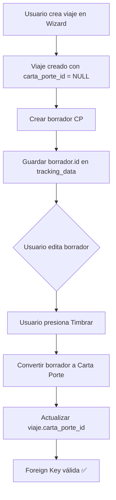

# 📋 Flujo de Creación: Viaje → Borrador CP → Carta Porte

## 📖 Descripción General

Este documento describe el flujo correcto para la creación de viajes y su vinculación con Cartas Porte, cumpliendo con las restricciones de foreign keys de la base de datos.

---

## 🔄 Flujo Completo

### **1️⃣ Crear Viaje**

**Tabla:** `viajes`

**Estado inicial:**
```typescript
{
  id: "uuid-del-viaje",
  carta_porte_id: NULL,           // ✅ NULL hasta timbrar
  estado: 'programado',
  tracking_data: {
    // Todos los datos del wizard
    origen: { ... },
    destino: { ... },
    cliente: { ... },
    // etc.
  }
}
```

**Archivo:** `src/hooks/useViajes.ts` → `crearViaje()`

---

### **2️⃣ Crear Borrador Carta Porte**

**Tabla:** `borradores_carta_porte`

**Acción:**
- Se crea un borrador con los datos mapeados del viaje
- El `borrador.id` se almacena en `viajes.tracking_data`
- **IMPORTANTE:** `viajes.carta_porte_id` permanece `NULL` ✅

**Archivo:** `src/services/viajes/ViajeCartaPorteService.ts` → `crearBorradorDesdeViaje()`

**Código relevante:**
```typescript
const trackingDataActualizado = {
  ...(viaje.tracking_data || {}),
  borrador_carta_porte_id: borrador.id,
  borrador_creado_en: new Date().toISOString()
};

await supabase
  .from('viajes')
  .update({ tracking_data: trackingDataActualizado })
  .eq('id', viajeId);
```

---

### **3️⃣ Usuario Edita Borrador**

**Interfaz:** Editor de Carta Porte

**Acciones del usuario:**
- Completa datos fiscales (RFC emisor, receptor, etc.)
- Valida información SAT 3.1
- Agrega figuras de transporte
- Revisa ubicaciones y mercancías

**Estado:** `viajes.carta_porte_id` sigue siendo `NULL` ✅

---

### **4️⃣ Timbrar Carta Porte**

**Tabla:** `cartas_porte`

**Acción:**
- Se convierte el borrador a Carta Porte oficial
- Se genera UUID fiscal
- Se actualiza `viajes.carta_porte_id` con el ID real ✅

**Archivo:** `src/services/cartaPorte/CartaPorteLifecycleManager.ts` → `vincularCartaPorteConViaje()`

**Código relevante:**
```typescript
await CartaPorteLifecycleManager.vincularCartaPorteConViaje(
  cartaPorteId,  // ID de la carta porte timbrada
  viajeId        // ID del viaje
);
```

**Resultado:**
```typescript
{
  id: "uuid-del-viaje",
  carta_porte_id: "uuid-carta-porte", // ✅ Ahora tiene valor
  estado: 'completado',
  tracking_data: {
    ...,
    borrador_carta_porte_id: "uuid-borrador",
    carta_porte_timbrada: true,
    fecha_timbre: "2025-10-25T..."
  }
}
```

---

## ✅ Validación de Foreign Key

La foreign key `fk_viajes_carta_porte` está configurada correctamente:

```sql
ALTER TABLE viajes 
ADD CONSTRAINT fk_viajes_carta_porte 
FOREIGN KEY (carta_porte_id) 
REFERENCES cartas_porte(id) 
ON DELETE SET NULL;
```

### **Comportamientos:**

| **Acción** | **Resultado** |
|-----------|---------------|
| Crear viaje | `carta_porte_id = NULL` ✅ |
| Crear borrador | `carta_porte_id = NULL` ✅ |
| Timbrar CP | `carta_porte_id = uuid` ✅ |
| Eliminar CP | `carta_porte_id = NULL` ✅ |

---

## 🚨 Errores Comunes (Y Cómo Evitarlos)

### ❌ **Error 1: Asignar ID de borrador a `carta_porte_id`**

**Incorrecto:**
```typescript
// ❌ MAL - Intenta asignar ID de borradores_carta_porte
await supabase
  .from('viajes')
  .update({ carta_porte_id: borrador.id })
  .eq('id', viajeId);
```

**Correcto:**
```typescript
// ✅ BIEN - Almacenar en tracking_data
const trackingData = {
  ...(viaje.tracking_data || {}),
  borrador_carta_porte_id: borrador.id
};

await supabase
  .from('viajes')
  .update({ tracking_data: trackingData })
  .eq('id', viajeId);
```

---

### ❌ **Error 2: No actualizar `carta_porte_id` después de timbrar**

**Problema:** El viaje queda sin referencia a la Carta Porte oficial.

**Solución:**
```typescript
// ✅ BIEN - Vincular después de timbrar
await CartaPorteLifecycleManager.vincularCartaPorteConViaje(
  cartaPorteId,
  viajeId
);
```

---

## 📊 Diagrama de Flujo



---

## 🔍 Queries de Verificación

### **Verificar viajes con carta_porte_id inválidos:**

```sql
SELECT v.id, v.origen, v.destino, v.carta_porte_id, v.estado
FROM viajes v
LEFT JOIN cartas_porte cp ON v.carta_porte_id = cp.id
WHERE v.carta_porte_id IS NOT NULL 
  AND cp.id IS NULL;
```

### **Verificar borradores vinculados:**

```sql
SELECT 
  id, 
  origen, 
  destino,
  carta_porte_id,
  tracking_data->>'borrador_carta_porte_id' as borrador_id,
  estado
FROM viajes
WHERE tracking_data->>'borrador_carta_porte_id' IS NOT NULL
ORDER BY created_at DESC
LIMIT 10;
```

---

## 📚 Referencias

- **Archivo principal:** `src/services/viajes/ViajeCartaPorteService.ts`
- **Lifecycle Manager:** `src/services/cartaPorte/CartaPorteLifecycleManager.ts`
- **Wizard:** `src/components/viajes/ViajeWizard.tsx`
- **Hook de viajes:** `src/hooks/useViajes.ts`

---

## ✨ Mejores Prácticas

1. ✅ **Siempre** crear viajes con `carta_porte_id = NULL`
2. ✅ **Siempre** almacenar `borrador_id` en `tracking_data`
3. ✅ **Siempre** actualizar `carta_porte_id` SOLO después de timbrar
4. ✅ **Siempre** usar `CartaPorteLifecycleManager.vincularCartaPorteConViaje()`
5. ✅ **Siempre** validar foreign keys antes de asignar IDs

---

**Última actualización:** 2025-10-25  
**Versión:** 1.0
